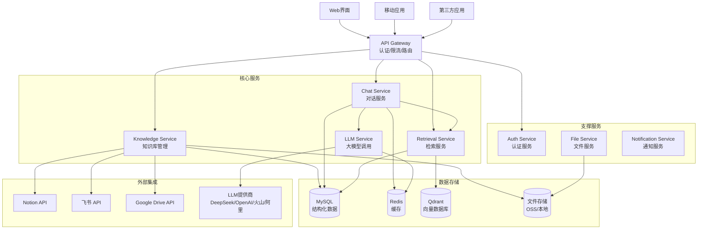

# AI知识库系统 - 设计文档

## 1. 架构概述

基于现有Kratos v2微服务架构，采用清洁架构分层设计，构建一个可扩展、高性能的AI知识库系统。系统采用事件驱动架构，支持异步处理和流式响应。

### 1.1 整体架构图



### 1.2 技术栈选择

**框架与库**：
- **Web框架**：Gin（性能优秀，生态丰富）
- **微服务框架**：Kratos v2（成熟稳定）
- **依赖注入**：Wire（编译时依赖注入）
- **配置管理**：Viper（支持多格式配置）

**数据存储**：
- **关系数据库**：MySQL 8.0+（ACID特性，成熟稳定）
- **向量数据库**：Qdrant（Go支持好，性能优秀）
- **缓存**：Redis 7.0+（高性能，丰富数据结构）
- **文件存储**：本地存储 + OSS（成本可控，可扩展）

**外部服务集成**：
- **Notion API**：jomei/notionapi（功能完整）
- **飞书API**：larksuite/oapi-sdk-go（官方SDK）
- **Google Drive API**：google.golang.org/api（官方SDK）
- **LLM集成**：多SDK支持（go-deepseek/deepseek等）

## 2. 核心组件设计

### 2.1 Knowledge Service（知识库服务）

**职责**：
- 文档上传、解析、存储
- 外部数据源同步
- 文档向量化处理
- 知识库元数据管理

**核心接口**：

```go
type KnowledgeService interface {
    // 文档管理
    UploadDocument(ctx context.Context, req *UploadDocumentRequest) (*DocumentResponse, error)
    DeleteDocument(ctx context.Context, docID string) error
    UpdateDocument(ctx context.Context, req *UpdateDocumentRequest) (*DocumentResponse, error)
    GetDocument(ctx context.Context, docID string) (*DocumentResponse, error)
    ListDocuments(ctx context.Context, req *ListDocumentsRequest) (*ListDocumentsResponse, error)
    
    // 外部数据源同步
    SyncNotionPages(ctx context.Context, req *SyncNotionRequest) error
    SyncFeishuDocs(ctx context.Context, req *SyncFeishuRequest) error
    SyncGoogleDocs(ctx context.Context, req *SyncGoogleRequest) error
    
    // 知识库管理
    CreateKnowledgeBase(ctx context.Context, req *CreateKnowledgeBaseRequest) (*KnowledgeBaseResponse, error)
    UpdateKnowledgeBase(ctx context.Context, req *UpdateKnowledgeBaseRequest) (*KnowledgeBaseResponse, error)
    DeleteKnowledgeBase(ctx context.Context, kbID string) error
}
```

**数据模型**：

```go
type KnowledgeBase struct {
    ID          string    `gorm:"primaryKey"`
    UserID      string    `gorm:"index"`
    Name        string
    Description string
    Settings    JSON      `gorm:"type:json"`
    CreatedAt   time.Time
    UpdatedAt   time.Time
}

type Document struct {
    ID             string    `gorm:"primaryKey"`
    KnowledgeBaseID string    `gorm:"index"`
    Title          string
    Content        string    `gorm:"type:longtext"`
    ContentType    string    // pdf, docx, txt, url, notion, feishu
    SourceType     string    // upload, notion, feishu, google, url
    SourceID       string    // 外部源ID
    FileHash       string    `gorm:"index"`
    FileSize       int64
    Status         string    // processing, completed, failed
    Metadata       JSON      `gorm:"type:json"`
    CreatedAt      time.Time
    UpdatedAt      time.Time
}

type DocumentChunk struct {
    ID         string  `gorm:"primaryKey"`
    DocumentID string  `gorm:"index"`
    Content    string  `gorm:"type:text"`
    ChunkIndex int     `gorm:"index"`
    Embedding  []byte  // 向量数据
    Metadata   JSON    `gorm:"type:json"`
    CreatedAt  time.Time
}
```

### 2.2 Chat Service（对话服务）

**职责**：
- 多轮对话管理
- 会话状态维护
- 流式响应处理
- 上下文记忆管理

**核心接口**：

```go
type ChatService interface {
    // 对话管理
    CreateConversation(ctx context.Context, req *CreateConversationRequest) (*ConversationResponse, error)
    GetConversation(ctx context.Context, conversationID string) (*ConversationResponse, error)
    ListConversations(ctx context.Context, req *ListConversationsRequest) (*ListConversationsResponse, error)
    DeleteConversation(ctx context.Context, conversationID string) error
    
    // 消息处理
    SendMessage(ctx context.Context, req *SendMessageRequest) (*MessageResponse, error)
    SendMessageStream(ctx context.Context, req *SendMessageRequest, stream ChatService_SendMessageStreamServer) error
    GetMessages(ctx context.Context, req *GetMessagesRequest) (*GetMessagesResponse, error)
    
    // 上下文管理
    UpdateContext(ctx context.Context, req *UpdateContextRequest) error
    ClearContext(ctx context.Context, conversationID string) error
}
```

**数据模型**：

```go
type Conversation struct {
    ID             string                 `gorm:"primaryKey"`
    UserID         string                 `gorm:"index"`
    KnowledgeBaseID string                 `gorm:"index"`
    Title          string
    Context        map[string]interface{} `gorm:"type:json"`
    Settings       ConversationSettings   `gorm:"type:json"`
    CreatedAt      time.Time
    UpdatedAt      time.Time
}

type Message struct {
    ID             string    `gorm:"primaryKey"`
    ConversationID string    `gorm:"index"`
    Role           string    // user, assistant, system
    Content        string    `gorm:"type:text"`
    Sources        []string  `gorm:"type:json"` // 引用来源
    TokenUsage     TokenInfo `gorm:"type:json"`
    Metadata       JSON      `gorm:"type:json"`
    CreatedAt      time.Time
}

type ConversationSettings struct {
    MaxTokens       int     `json:"max_tokens"`
    Temperature     float32 `json:"temperature"`
    TopP           float32 `json:"top_p"`
    LLMProvider    string  `json:"llm_provider"`
    Model          string  `json:"model"`
    EnableRetrieval bool    `json:"enable_retrieval"`
    MaxSources     int     `json:"max_sources"`
}
```

### 2.3 Retrieval Service（检索服务）

**职责**：
- 向量相似性搜索
- 混合检索（向量+全文）
- 检索结果排序和过滤
- 检索性能优化

**核心接口**：

```go
type RetrievalService interface {
    // 向量检索
    SearchSimilar(ctx context.Context, req *SearchSimilarRequest) (*SearchResponse, error)
    SearchHybrid(ctx context.Context, req *SearchHybridRequest) (*SearchResponse, error)
    
    // 索引管理
    CreateIndex(ctx context.Context, req *CreateIndexRequest) error
    UpdateIndex(ctx context.Context, req *UpdateIndexRequest) error
    DeleteIndex(ctx context.Context, indexID string) error
    
    // 向量操作
    GenerateEmbedding(ctx context.Context, req *EmbeddingRequest) (*EmbeddingResponse, error)
    BatchGenerateEmbeddings(ctx context.Context, req *BatchEmbeddingRequest) (*BatchEmbeddingResponse, error)
}
```

**检索策略**：

```go
type SearchStrategy struct {
    VectorWeight   float32 `json:"vector_weight"`   // 向量搜索权重
    KeywordWeight  float32 `json:"keyword_weight"`  // 关键词搜索权重
    SemanticBoost  float32 `json:"semantic_boost"`  // 语义相关性增强
    RecencyBoost   float32 `json:"recency_boost"`   // 时间新鲜度增强
    SourceBoost    map[string]float32 `json:"source_boost"` // 数据源权重
}
```

### 2.4 LLM Service（大模型服务）

**职责**：
- 多LLM供应商管理
- 负载均衡和故障转移
- API调用限流和重试
- 成本监控和使用统计

**核心接口**：

```go
type LLMService interface {
    // 基础调用
    Complete(ctx context.Context, req *CompletionRequest) (*CompletionResponse, error)
    CompleteStream(ctx context.Context, req *CompletionRequest, stream LLMService_CompleteStreamServer) error
    
    // 提供商管理
    ListProviders(ctx context.Context) (*ListProvidersResponse, error)
    GetProvider(ctx context.Context, providerID string) (*ProviderResponse, error)
    UpdateProvider(ctx context.Context, req *UpdateProviderRequest) (*ProviderResponse, error)
    
    // 使用统计
    GetUsageStats(ctx context.Context, req *UsageStatsRequest) (*UsageStatsResponse, error)
}
```

**供应商抽象**：

```go
type LLMProvider interface {
    GetName() string
    GetModels() []ModelInfo
    Complete(ctx context.Context, req *CompletionRequest) (*CompletionResponse, error)
    CompleteStream(ctx context.Context, req *CompletionRequest, callback StreamCallback) error
    GetUsage() *UsageInfo
    IsHealthy() bool
}

type ProviderManager struct {
    providers map[string]LLMProvider
    selector  ProviderSelector
    monitor   UsageMonitor
}

type ProviderSelector interface {
    Select(ctx context.Context, req *CompletionRequest) (LLMProvider, error)
    UpdateWeights(weights map[string]float32)
}
```

## 3. 数据模型设计

### 3.1 MySQL数据模型

**用户和权限**：
```sql
-- 用户扩展表（复用现有用户系统）
CREATE TABLE user_ai_profiles (
    id VARCHAR(64) PRIMARY KEY,
    user_id VARCHAR(64) NOT NULL,
    preferences JSON,
    api_quota JSON,
    created_at TIMESTAMP DEFAULT CURRENT_TIMESTAMP,
    updated_at TIMESTAMP DEFAULT CURRENT_TIMESTAMP ON UPDATE CURRENT_TIMESTAMP,
    INDEX idx_user_id (user_id)
);

-- 知识库表
CREATE TABLE knowledge_bases (
    id VARCHAR(64) PRIMARY KEY,
    user_id VARCHAR(64) NOT NULL,
    name VARCHAR(255) NOT NULL,
    description TEXT,
    settings JSON,
    status VARCHAR(32) DEFAULT 'active',
    created_at TIMESTAMP DEFAULT CURRENT_TIMESTAMP,
    updated_at TIMESTAMP DEFAULT CURRENT_TIMESTAMP ON UPDATE CURRENT_TIMESTAMP,
    INDEX idx_user_id (user_id),
    INDEX idx_status (status)
);

-- 文档表
CREATE TABLE documents (
    id VARCHAR(64) PRIMARY KEY,
    knowledge_base_id VARCHAR(64) NOT NULL,
    title VARCHAR(255) NOT NULL,
    content_type VARCHAR(64) NOT NULL,
    source_type VARCHAR(64) NOT NULL,
    source_id VARCHAR(255),
    file_path VARCHAR(512),
    file_hash VARCHAR(128),
    file_size BIGINT,
    status VARCHAR(32) DEFAULT 'processing',
    metadata JSON,
    created_at TIMESTAMP DEFAULT CURRENT_TIMESTAMP,
    updated_at TIMESTAMP DEFAULT CURRENT_TIMESTAMP ON UPDATE CURRENT_TIMESTAMP,
    INDEX idx_kb_id (knowledge_base_id),
    INDEX idx_status (status),
    INDEX idx_file_hash (file_hash)
);

-- 文档分块表
CREATE TABLE document_chunks (
    id VARCHAR(64) PRIMARY KEY,
    document_id VARCHAR(64) NOT NULL,
    content TEXT NOT NULL,
    chunk_index INT NOT NULL,
    token_count INT,
    metadata JSON,
    created_at TIMESTAMP DEFAULT CURRENT_TIMESTAMP,
    INDEX idx_document_id (document_id),
    INDEX idx_chunk_index (document_id, chunk_index)
);
```

**对话和消息**：
```sql
-- 对话表
CREATE TABLE conversations (
    id VARCHAR(64) PRIMARY KEY,
    user_id VARCHAR(64) NOT NULL,
    knowledge_base_id VARCHAR(64),
    title VARCHAR(255) NOT NULL,
    context JSON,
    settings JSON,
    status VARCHAR(32) DEFAULT 'active',
    created_at TIMESTAMP DEFAULT CURRENT_TIMESTAMP,
    updated_at TIMESTAMP DEFAULT CURRENT_TIMESTAMP ON UPDATE CURRENT_TIMESTAMP,
    INDEX idx_user_id (user_id),
    INDEX idx_kb_id (knowledge_base_id)
);

-- 消息表
CREATE TABLE messages (
    id VARCHAR(64) PRIMARY KEY,
    conversation_id VARCHAR(64) NOT NULL,
    role VARCHAR(32) NOT NULL,
    content TEXT NOT NULL,
    sources JSON,
    token_usage JSON,
    metadata JSON,
    created_at TIMESTAMP DEFAULT CURRENT_TIMESTAMP,
    INDEX idx_conversation_id (conversation_id),
    INDEX idx_created_at (created_at)
);
```

### 3.2 Qdrant向量数据模型

**Collection配置**：
```json
{
  "collection_name": "knowledge_vectors",
  "vector_config": {
    "size": 1536,
    "distance": "Cosine"
  },
  "payload_schema": {
    "document_id": "keyword",
    "chunk_id": "keyword", 
    "knowledge_base_id": "keyword",
    "content": "text",
    "metadata": "json"
  }
}
```

**向量点结构**：
```json
{
  "id": "chunk_id",
  "vector": [0.1, 0.2, ...],
  "payload": {
    "document_id": "doc_123",
    "chunk_id": "chunk_456",
    "knowledge_base_id": "kb_789",
    "content": "原始文本内容",
    "metadata": {
      "title": "文档标题",
      "source": "notion",
      "timestamp": "2024-01-01T00:00:00Z"
    }
  }
}
```

### 3.3 Redis缓存策略

**缓存键设计**：
```
# 会话缓存
session:{conversation_id} -> ConversationContext (TTL: 1小时)

# API响应缓存  
api_cache:{hash} -> APIResponse (TTL: 10分钟)

# 用户配额缓存
quota:{user_id}:{date} -> UsageCount (TTL: 1天)

# 向量缓存
embedding:{content_hash} -> EmbeddingVector (TTL: 7天)

# 检索结果缓存
search:{query_hash} -> SearchResults (TTL: 30分钟)
```

## 4. API接口设计

### 4.1 RESTful API设计

**知识库管理API**：
```
POST   /api/v1/knowledge-bases          # 创建知识库
GET    /api/v1/knowledge-bases          # 获取知识库列表
GET    /api/v1/knowledge-bases/:id      # 获取知识库详情
PUT    /api/v1/knowledge-bases/:id      # 更新知识库
DELETE /api/v1/knowledge-bases/:id      # 删除知识库

POST   /api/v1/knowledge-bases/:id/documents        # 上传文档
GET    /api/v1/knowledge-bases/:id/documents        # 获取文档列表
GET    /api/v1/knowledge-bases/:id/documents/:docId # 获取文档详情
PUT    /api/v1/knowledge-bases/:id/documents/:docId # 更新文档
DELETE /api/v1/knowledge-bases/:id/documents/:docId # 删除文档

POST   /api/v1/knowledge-bases/:id/sync/notion      # 同步Notion
POST   /api/v1/knowledge-bases/:id/sync/feishu      # 同步飞书
POST   /api/v1/knowledge-bases/:id/sync/google      # 同步Google
```

**对话管理API**：
```
POST   /api/v1/conversations              # 创建对话
GET    /api/v1/conversations              # 获取对话列表
GET    /api/v1/conversations/:id          # 获取对话详情
PUT    /api/v1/conversations/:id          # 更新对话
DELETE /api/v1/conversations/:id          # 删除对话

POST   /api/v1/conversations/:id/messages # 发送消息
GET    /api/v1/conversations/:id/messages # 获取消息历史
GET    /api/v1/conversations/:id/stream   # 流式对话 (WebSocket)
```

**检索API**：
```
POST   /api/v1/search/semantic           # 语义搜索
POST   /api/v1/search/hybrid            # 混合搜索
GET    /api/v1/search/suggest           # 搜索建议
```

**管理API**：
```
GET    /api/v1/admin/providers          # LLM供应商列表
PUT    /api/v1/admin/providers/:id      # 更新供应商配置
GET    /api/v1/admin/usage-stats       # 使用统计
GET    /api/v1/admin/health-check      # 健康检查
```

### 4.2 gRPC API设计

**Protocol Buffer定义**：
```protobuf
syntax = "proto3";

package ai.v1;

import "google/api/annotations.proto";
import "validate/validate.proto";

service AIService {
  // 知识库管理
  rpc CreateKnowledgeBase(CreateKnowledgeBaseRequest) returns (KnowledgeBaseResponse) {
    option (google.api.http) = {
      post: "/api/v1/knowledge-bases"
      body: "*"
    };
  }
  
  rpc UploadDocument(UploadDocumentRequest) returns (DocumentResponse) {
    option (google.api.http) = {
      post: "/api/v1/knowledge-bases/{knowledge_base_id}/documents"
      body: "*"
    };
  }
  
  // 对话管理
  rpc SendMessage(SendMessageRequest) returns (MessageResponse) {
    option (google.api.http) = {
      post: "/api/v1/conversations/{conversation_id}/messages"
      body: "*"
    };
  }
  
  rpc SendMessageStream(SendMessageRequest) returns (stream MessageStreamResponse);
  
  // 检索
  rpc SearchSemantic(SearchRequest) returns (SearchResponse) {
    option (google.api.http) = {
      post: "/api/v1/search/semantic"
      body: "*"
    };
  }
}

message SendMessageRequest {
  string conversation_id = 1 [(validate.rules).string.min_len = 1];
  string content = 2 [(validate.rules).string.min_len = 1];
  MessageSettings settings = 3;
}

message MessageSettings {
  string llm_provider = 1;
  string model = 2;
  int32 max_tokens = 3;
  float temperature = 4;
  bool enable_retrieval = 5;
  int32 max_sources = 6;
}
```

## 5. 错误处理设计

### 5.1 错误码定义

```go
// 使用现有的errorsx包扩展AI相关错误码
const (
    // 知识库相关错误 (20000-20099)
    ErrKnowledgeBaseNotFound     = 20001
    ErrKnowledgeBaseAccessDenied = 20002
    ErrDocumentUploadFailed      = 20003
    ErrDocumentParseFailed       = 20004
    ErrVectorIndexFailed         = 20005
    
    // 对话相关错误 (20100-20199)
    ErrConversationNotFound      = 20101
    ErrMessageTooLong            = 20102
    ErrContextLimitExceeded      = 20103
    
    // LLM相关错误 (20200-20299)
    ErrLLMProviderUnavailable    = 20201
    ErrLLMQuotaExceeded          = 20202
    ErrLLMRequestFailed          = 20203
    
    // 检索相关错误 (20300-20399)
    ErrSearchFailed              = 20301
    ErrVectorSearchFailed        = 20302
    ErrEmbeddingGenerationFailed = 20303
    
    // 外部集成错误 (20400-20499)
    ErrNotionAPIFailed           = 20401
    ErrFeishuAPIFailed           = 20402
    ErrGoogleAPIFailed           = 20403
)
```

### 5.2 错误处理中间件

```go
func AIErrorHandler() gin.HandlerFunc {
    return func(c *gin.Context) {
        c.Next()
        
        if len(c.Errors) > 0 {
            err := c.Errors.Last().Err
            
            switch e := err.(type) {
            case *errorsx.Error:
                handleAIError(c, e)
            default:
                handleGenericError(c, err)
            }
        }
    }
}

func handleAIError(c *gin.Context, err *errorsx.Error) {
    response := ErrorResponse{
        Code:      err.Code,
        Message:   err.Message,
        Details:   err.Details,
        RequestID: c.GetString("request_id"),
        Timestamp: time.Now().Unix(),
    }
    
    // 特殊错误处理
    switch err.Code {
    case ErrLLMQuotaExceeded:
        c.Header("Retry-After", "3600") // 1小时后重试
    case ErrVectorSearchFailed:
        response.Suggestion = "请尝试使用不同的搜索关键词"
    }
    
    c.JSON(err.HTTPStatus(), response)
}
```

## 6. 安全设计

### 6.1 认证和授权

**JWT认证集成**：
```go
type AIAuthMiddleware struct {
    authService auth.Service
    rbac       rbac.Service
}

func (m *AIAuthMiddleware) RequireAuth() gin.HandlerFunc {
    return func(c *gin.Context) {
        token := extractToken(c)
        if token == "" {
            c.JSON(401, gin.H{"error": "missing token"})
            c.Abort()
            return
        }
        
        claims, err := m.authService.ValidateToken(token)
        if err != nil {
            c.JSON(401, gin.H{"error": "invalid token"})
            c.Abort()
            return
        }
        
        c.Set("user_id", claims.UserID)
        c.Set("user_role", claims.Role)
        c.Next()
    }
}

func (m *AIAuthMiddleware) RequirePermission(resource, action string) gin.HandlerFunc {
    return func(c *gin.Context) {
        userID := c.GetString("user_id")
        userRole := c.GetString("user_role")
        
        allowed, err := m.rbac.CheckPermission(userID, userRole, resource, action)
        if err != nil || !allowed {
            c.JSON(403, gin.H{"error": "permission denied"})
            c.Abort()
            return
        }
        
        c.Next()
    }
}
```

**权限模型**：
```
资源类型:
- knowledge_base: 知识库管理
- conversation: 对话管理
- document: 文档管理
- admin: 系统管理

操作类型:
- create: 创建
- read: 读取  
- update: 更新
- delete: 删除
- manage: 管理

角色定义:
- admin: 系统管理员 (所有权限)
- user: 普通用户 (个人资源的CRUD权限)
- viewer: 只读用户 (只读权限)
```

### 6.2 数据安全

**敏感数据加密**：
```go
type EncryptionService interface {
    Encrypt(data []byte, keyID string) ([]byte, error)
    Decrypt(encryptedData []byte, keyID string) ([]byte, error)
    GenerateKey() (string, error)
}

// API密钥加密存储
type APIKeyManager struct {
    encryption EncryptionService
    keyVault   KeyVault
}

func (m *APIKeyManager) StoreAPIKey(userID, provider, apiKey string) error {
    keyID := fmt.Sprintf("%s:%s", userID, provider)
    
    encryptedKey, err := m.encryption.Encrypt([]byte(apiKey), keyID)
    if err != nil {
        return err
    }
    
    return m.keyVault.Store(keyID, encryptedKey)
}
```

**输入验证和过滤**：
```go
type InputValidator struct {
    maxFileSize    int64
    allowedTypes   []string
    contentFilter  ContentFilter
}

func (v *InputValidator) ValidateDocument(file multipart.File, header *multipart.FileHeader) error {
    // 文件大小验证
    if header.Size > v.maxFileSize {
        return errorsx.NewBadRequest("文件大小超出限制")
    }
    
    // 文件类型验证
    contentType := header.Header.Get("Content-Type")
    if !v.isAllowedType(contentType) {
        return errorsx.NewBadRequest("不支持的文件类型")
    }
    
    // 恶意内容检测
    content, err := io.ReadAll(file)
    if err != nil {
        return err
    }
    
    if v.contentFilter.ContainsMaliciousContent(content) {
        return errorsx.NewBadRequest("文件包含危险内容")
    }
    
    return nil
}
```

## 7. 性能优化设计

### 7.1 缓存策略

**多级缓存架构**：
```go
type CacheManager struct {
    l1Cache cache.LocalCache  // 本地缓存
    l2Cache cache.RedisCache  // Redis缓存
    l3Cache cache.CDNCache    // CDN缓存
}

func (m *CacheManager) Get(ctx context.Context, key string) (interface{}, error) {
    // L1: 本地缓存
    if value, ok := m.l1Cache.Get(key); ok {
        return value, nil
    }
    
    // L2: Redis缓存
    if value, err := m.l2Cache.Get(ctx, key); err == nil {
        m.l1Cache.Set(key, value, 5*time.Minute)
        return value, nil
    }
    
    // L3: CDN缓存 (用于文件等静态资源)
    if value, err := m.l3Cache.Get(ctx, key); err == nil {
        m.l2Cache.Set(ctx, key, value, 30*time.Minute)
        m.l1Cache.Set(key, value, 5*time.Minute)
        return value, nil
    }
    
    return nil, cache.ErrNotFound
}
```

### 7.2 异步处理

**文档处理流水线**：
```go
type DocumentProcessor struct {
    uploadQueue    queue.Queue
    parseQueue     queue.Queue
    vectorQueue    queue.Queue
    indexQueue     queue.Queue
}

func (p *DocumentProcessor) ProcessDocument(ctx context.Context, docID string) error {
    // 1. 上传处理
    if err := p.uploadQueue.Enqueue(ctx, &UploadTask{DocumentID: docID}); err != nil {
        return err
    }
    
    // 2. 解析处理 (异步)
    go p.processParseQueue(ctx)
    
    // 3. 向量化处理 (异步)
    go p.processVectorQueue(ctx)
    
    // 4. 索引构建 (异步)
    go p.processIndexQueue(ctx)
    
    return nil
}

func (p *DocumentProcessor) processParseQueue(ctx context.Context) {
    for {
        task, err := p.parseQueue.Dequeue(ctx)
        if err != nil {
            continue
        }
        
        if err := p.parseDocument(ctx, task.(*ParseTask)); err != nil {
            // 错误处理和重试
            p.handleParseError(ctx, task, err)
        } else {
            // 成功后加入下一个队列
            p.vectorQueue.Enqueue(ctx, &VectorTask{DocumentID: task.DocumentID})
        }
    }
}
```

### 7.3 连接池优化

**数据库连接池配置**：
```go
type DBConfig struct {
    MaxOpenConns    int           `yaml:"max_open_conns"`    // 最大连接数
    MaxIdleConns    int           `yaml:"max_idle_conns"`    // 最大空闲连接数
    ConnMaxLifetime time.Duration `yaml:"conn_max_lifetime"` // 连接最大生命周期
    ConnMaxIdleTime time.Duration `yaml:"conn_max_idle_time"` // 连接最大空闲时间
}

func NewDatabaseConnection(config *DBConfig) (*gorm.DB, error) {
    db, err := gorm.Open(mysql.Open(dsn), &gorm.Config{})
    if err != nil {
        return nil, err
    }
    
    sqlDB, err := db.DB()
    if err != nil {
        return nil, err
    }
    
    // 连接池配置
    sqlDB.SetMaxOpenConns(config.MaxOpenConns)
    sqlDB.SetMaxIdleConns(config.MaxIdleConns)
    sqlDB.SetConnMaxLifetime(config.ConnMaxLifetime)
    sqlDB.SetConnMaxIdleTime(config.ConnMaxIdleTime)
    
    return db, nil
}
```

## 8. 监控和可观测性

### 8.1 指标定义

**业务指标**：
```go
var (
    // 文档处理指标
    DocumentsUploaded = prometheus.NewCounterVec(
        prometheus.CounterOpts{
            Name: "ai_documents_uploaded_total",
            Help: "Total number of documents uploaded",
        },
        []string{"knowledge_base_id", "content_type", "source_type"},
    )
    
    DocumentProcessingDuration = prometheus.NewHistogramVec(
        prometheus.HistogramOpts{
            Name:    "ai_document_processing_duration_seconds",
            Help:    "Time spent processing documents",
            Buckets: prometheus.DefBuckets,
        },
        []string{"operation", "content_type"},
    )
    
    // 对话指标
    ConversationsCreated = prometheus.NewCounterVec(
        prometheus.CounterOpts{
            Name: "ai_conversations_created_total",
            Help: "Total number of conversations created",
        },
        []string{"knowledge_base_id"},
    )
    
    MessagesProcessed = prometheus.NewCounterVec(
        prometheus.CounterOpts{
            Name: "ai_messages_processed_total",
            Help: "Total number of messages processed",
        },
        []string{"llm_provider", "model", "status"},
    )
    
    // LLM调用指标
    LLMRequestDuration = prometheus.NewHistogramVec(
        prometheus.HistogramOpts{
            Name:    "ai_llm_request_duration_seconds",
            Help:    "Time spent on LLM requests",
            Buckets: []float64{0.1, 0.5, 1, 2, 5, 10, 30},
        },
        []string{"provider", "model"},
    )
    
    TokensUsed = prometheus.NewCounterVec(
        prometheus.CounterOpts{
            Name: "ai_tokens_used_total",
            Help: "Total number of tokens used",
        },
        []string{"provider", "model", "type"}, // type: input/output
    )
    
    // 检索指标
    SearchRequestDuration = prometheus.NewHistogramVec(
        prometheus.HistogramOpts{
            Name:    "ai_search_request_duration_seconds",
            Help:    "Time spent on search requests",
            Buckets: []float64{0.01, 0.05, 0.1, 0.2, 0.5, 1, 2},
        },
        []string{"search_type", "knowledge_base_id"},
    )
)
```

### 8.2 链路追踪

**分布式追踪集成**：
```go
func (s *ChatService) SendMessage(ctx context.Context, req *SendMessageRequest) (*MessageResponse, error) {
    span, ctx := opentracing.StartSpanFromContext(ctx, "chat.send_message")
    defer span.Finish()
    
    span.SetTag("conversation_id", req.ConversationID)
    span.SetTag("message_length", len(req.Content))
    
    // 1. 检索相关文档
    retrievalSpan, ctx := opentracing.StartSpanFromContext(ctx, "retrieval.search")
    documents, err := s.retrievalService.SearchSimilar(ctx, &SearchSimilarRequest{
        Query: req.Content,
        KnowledgeBaseID: req.KnowledgeBaseID,
        TopK: 5,
    })
    retrievalSpan.Finish()
    
    if err != nil {
        span.SetTag("error", true)
        span.LogFields(log.String("error.message", err.Error()))
        return nil, err
    }
    
    // 2. 调用LLM
    llmSpan, ctx := opentracing.StartSpanFromContext(ctx, "llm.complete")
    llmSpan.SetTag("provider", req.Settings.LLMProvider)
    llmSpan.SetTag("model", req.Settings.Model)
    
    response, err := s.llmService.Complete(ctx, &CompletionRequest{
        Messages: buildMessages(req.Content, documents),
        Settings: req.Settings,
    })
    llmSpan.Finish()
    
    if err != nil {
        span.SetTag("error", true)
        return nil, err
    }
    
    // 3. 保存消息
    dbSpan, ctx := opentracing.StartSpanFromContext(ctx, "db.save_message")
    message := &Message{
        ConversationID: req.ConversationID,
        Role:          "assistant",
        Content:       response.Content,
        Sources:       extractSources(documents),
        TokenUsage:    response.Usage,
    }
    
    err = s.messageRepo.Create(ctx, message)
    dbSpan.Finish()
    
    if err != nil {
        span.SetTag("error", true)
        return nil, err
    }
    
    return &MessageResponse{
        Message: message,
    }, nil
}
```

### 8.3 健康检查

**综合健康检查**：
```go
type HealthChecker struct {
    db           *gorm.DB
    redis        redis.Client
    qdrant       qdrant.Client
    llmProviders map[string]LLMProvider
}

func (h *HealthChecker) Check(ctx context.Context) (*HealthStatus, error) {
    status := &HealthStatus{
        Status: "healthy",
        Checks: make(map[string]CheckResult),
    }
    
    // 数据库健康检查
    if err := h.checkDatabase(ctx); err != nil {
        status.Checks["database"] = CheckResult{
            Status: "unhealthy",
            Error:  err.Error(),
        }
        status.Status = "degraded"
    } else {
        status.Checks["database"] = CheckResult{Status: "healthy"}
    }
    
    // Redis健康检查
    if err := h.checkRedis(ctx); err != nil {
        status.Checks["redis"] = CheckResult{
            Status: "unhealthy", 
            Error:  err.Error(),
        }
        status.Status = "degraded"
    } else {
        status.Checks["redis"] = CheckResult{Status: "healthy"}
    }
    
    // Qdrant健康检查
    if err := h.checkQdrant(ctx); err != nil {
        status.Checks["qdrant"] = CheckResult{
            Status: "unhealthy",
            Error:  err.Error(),
        }
        status.Status = "degraded"
    } else {
        status.Checks["qdrant"] = CheckResult{Status: "healthy"}
    }
    
    // LLM供应商健康检查
    llmStatus := make(map[string]CheckResult)
    allUnhealthy := true
    
    for name, provider := range h.llmProviders {
        if provider.IsHealthy() {
            llmStatus[name] = CheckResult{Status: "healthy"}
            allUnhealthy = false
        } else {
            llmStatus[name] = CheckResult{
                Status: "unhealthy",
                Error:  "provider not responding",
            }
        }
    }
    
    status.Checks["llm_providers"] = CheckResult{
        Status:  map[bool]string{true: "unhealthy", false: "healthy"}[allUnhealthy],
        Details: llmStatus,
    }
    
    if allUnhealthy {
        status.Status = "unhealthy"
    }
    
    return status, nil
}
```

## 9. 部署架构

### 9.1 微服务部署

**Docker Compose配置**：
```yaml
version: '3.8'

services:
  # API Gateway
  gateway:
    image: nginx:alpine
    ports:
      - "8080:80"
    volumes:
      - ./nginx.conf:/etc/nginx/nginx.conf
    depends_on:
      - knowledge-service
      - chat-service
      - retrieval-service
      - llm-service

  # Knowledge Service
  knowledge-service:
    build: ./cmd/knowledge-service
    environment:
      - DB_HOST=mysql
      - REDIS_HOST=redis
      - QDRANT_HOST=qdrant
    depends_on:
      - mysql
      - redis
      - qdrant

  # Chat Service
  chat-service:
    build: ./cmd/chat-service
    environment:
      - DB_HOST=mysql
      - REDIS_HOST=redis
    depends_on:
      - mysql
      - redis

  # Retrieval Service
  retrieval-service:
    build: ./cmd/retrieval-service
    environment:
      - QDRANT_HOST=qdrant
      - REDIS_HOST=redis
    depends_on:
      - qdrant
      - redis

  # LLM Service
  llm-service:
    build: ./cmd/llm-service
    environment:
      - REDIS_HOST=redis
    depends_on:
      - redis

  # Databases
  mysql:
    image: mysql:8.0
    environment:
      MYSQL_DATABASE: ai_knowledge
      MYSQL_USER: ai_user
      MYSQL_PASSWORD: ai_password
      MYSQL_ROOT_PASSWORD: root_password
    volumes:
      - mysql_data:/var/lib/mysql
    ports:
      - "3306:3306"

  redis:
    image: redis:7-alpine
    ports:
      - "6379:6379"
    volumes:
      - redis_data:/data

  qdrant:
    image: qdrant/qdrant:latest
    ports:
      - "6333:6333"
    volumes:
      - qdrant_data:/qdrant/storage

volumes:
  mysql_data:
  redis_data:
  qdrant_data:
```

### 9.2 Kubernetes部署

**服务部署清单**：
```yaml
apiVersion: apps/v1
kind: Deployment
metadata:
  name: ai-knowledge-service
spec:
  replicas: 3
  selector:
    matchLabels:
      app: ai-knowledge-service
  template:
    metadata:
      labels:
        app: ai-knowledge-service
    spec:
      containers:
      - name: knowledge-service
        image: ai-knowledge/knowledge-service:latest
        ports:
        - containerPort: 8080
        env:
        - name: DB_HOST
          value: mysql-service
        - name: REDIS_HOST
          value: redis-service
        - name: QDRANT_HOST
          value: qdrant-service
        resources:
          requests:
            memory: "256Mi"
            cpu: "250m"
          limits:
            memory: "512Mi"
            cpu: "500m"
        readinessProbe:
          httpGet:
            path: /health
            port: 8080
          initialDelaySeconds: 10
          periodSeconds: 5
        livenessProbe:
          httpGet:
            path: /health
            port: 8080
          initialDelaySeconds: 30
          periodSeconds: 10

---
apiVersion: v1
kind: Service
metadata:
  name: ai-knowledge-service
spec:
  selector:
    app: ai-knowledge-service
  ports:
  - port: 80
    targetPort: 8080
  type: ClusterIP
```

## 10. 测试策略

### 10.1 单元测试

**服务层测试示例**：
```go
func TestChatService_SendMessage(t *testing.T) {
    // Setup
    mockRepo := &MockMessageRepository{}
    mockLLM := &MockLLMService{}
    mockRetrieval := &MockRetrievalService{}
    
    service := NewChatService(mockRepo, mockLLM, mockRetrieval)
    
    // Test cases
    tests := []struct {
        name     string
        request  *SendMessageRequest
        mockSetup func()
        want     *MessageResponse
        wantErr  bool
    }{
        {
            name: "successful message sending",
            request: &SendMessageRequest{
                ConversationID: "conv_123",
                Content:       "Hello, AI!",
                Settings: &MessageSettings{
                    LLMProvider: "deepseek",
                    Model:      "deepseek-v3",
                },
            },
            mockSetup: func() {
                mockRetrieval.On("SearchSimilar", mock.Anything, mock.Anything).
                    Return(&SearchResponse{Documents: []*Document{}}, nil)
                
                mockLLM.On("Complete", mock.Anything, mock.Anything).
                    Return(&CompletionResponse{
                        Content: "Hello! How can I help you?",
                        Usage:   &TokenInfo{InputTokens: 10, OutputTokens: 15},
                    }, nil)
                
                mockRepo.On("Create", mock.Anything, mock.Anything).
                    Return(nil)
            },
            want: &MessageResponse{
                Message: &Message{
                    ConversationID: "conv_123",
                    Role:          "assistant",
                    Content:       "Hello! How can I help you?",
                },
            },
            wantErr: false,
        },
    }
    
    for _, tt := range tests {
        t.Run(tt.name, func(t *testing.T) {
            tt.mockSetup()
            
            got, err := service.SendMessage(context.Background(), tt.request)
            
            if (err != nil) != tt.wantErr {
                t.Errorf("SendMessage() error = %v, wantErr %v", err, tt.wantErr)
                return
            }
            
            assert.Equal(t, tt.want.Message.Content, got.Message.Content)
            assert.Equal(t, tt.want.Message.Role, got.Message.Role)
        })
    }
}
```

### 10.2 集成测试

**API集成测试**：
```go
func TestKnowledgeAPI_Integration(t *testing.T) {
    // Setup test environment
    testDB := setupTestDatabase(t)
    testRedis := setupTestRedis(t)
    testQdrant := setupTestQdrant(t)
    
    defer cleanupTest(testDB, testRedis, testQdrant)
    
    // Initialize services
    app := setupTestApp(testDB, testRedis, testQdrant)
    
    t.Run("document upload and retrieval workflow", func(t *testing.T) {
        // 1. Create knowledge base
        kbResp := createKnowledgeBase(t, app, &CreateKnowledgeBaseRequest{
            Name:        "Test KB",
            Description: "Test knowledge base",
        })
        
        // 2. Upload document
        docResp := uploadDocument(t, app, kbResp.ID, "test.pdf", testPDFContent)
        
        // Wait for processing
        waitForDocumentProcessing(t, app, docResp.ID)
        
        // 3. Search documents
        searchResp := searchDocuments(t, app, kbResp.ID, "test query")
        
        assert.NotEmpty(t, searchResp.Documents)
        assert.Contains(t, searchResp.Documents[0].Content, "expected content")
    })
    
    t.Run("chat with knowledge base", func(t *testing.T) {
        // 1. Create conversation
        convResp := createConversation(t, app, &CreateConversationRequest{
            KnowledgeBaseID: testKBID,
            Title:          "Test Chat",
        })
        
        // 2. Send message
        msgResp := sendMessage(t, app, convResp.ID, &SendMessageRequest{
            Content: "What is the main topic of the uploaded document?",
            Settings: &MessageSettings{
                LLMProvider:     "mock",
                Model:          "mock-model",
                EnableRetrieval: true,
            },
        })
        
        assert.NotEmpty(t, msgResp.Message.Content)
        assert.NotEmpty(t, msgResp.Message.Sources)
    })
}
```

### 10.3 性能测试

**负载测试配置**：
```go
func BenchmarkChatService_SendMessage(b *testing.B) {
    service := setupBenchmarkService(b)
    
    request := &SendMessageRequest{
        ConversationID: "bench_conv",
        Content:       "Test message for benchmarking",
        Settings: &MessageSettings{
            LLMProvider: "mock",
            Model:      "mock-model",
        },
    }
    
    b.ResetTimer()
    b.RunParallel(func(pb *testing.PB) {
        for pb.Next() {
            _, err := service.SendMessage(context.Background(), request)
            if err != nil {
                b.Errorf("SendMessage failed: %v", err)
            }
        }
    })
}

func BenchmarkRetrievalService_SearchSimilar(b *testing.B) {
    service := setupBenchmarkRetrievalService(b)
    
    request := &SearchSimilarRequest{
        Query:           "benchmark search query",
        KnowledgeBaseID: "bench_kb",
        TopK:           10,
    }
    
    b.ResetTimer()
    for i := 0; i < b.N; i++ {
        _, err := service.SearchSimilar(context.Background(), request)
        if err != nil {
            b.Errorf("SearchSimilar failed: %v", err)
        }
    }
}
```

这个设计文档提供了AI知识库系统的全面技术设计，涵盖了架构、组件、数据模型、API、安全、性能、监控、部署和测试等各个方面。设计充分考虑了与现有Kratos v2架构的集成，保持了技术栈的一致性和可维护性。