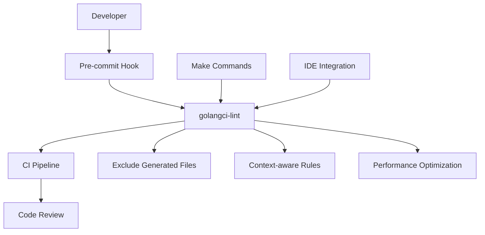

# golangci-lint Configuration Design

## Overview

This design document outlines a comprehensive golangci-lint configuration for the go-protoc project. The configuration aims to provide production-ready code quality enforcement that aligns with the project's mature architecture, clean design patterns, and microservices-oriented development approach.

The current `.golangci.yaml` file contains basic configuration but lacks comprehensive linter coverage, proper exclusions for generated files, and integration with the project's build workflow. This design addresses these gaps while maintaining development velocity.

## Architecture

### Configuration Strategy

The golangci-lint configuration follows a **layered approach**:

1. **Foundation Layer**: Essential linters for basic Go best practices
2. **Quality Layer**: Code quality and maintainability linters  
3. **Security Layer**: Security-focused linters for production code
4. **Performance Layer**: Performance and efficiency linters
5. **Architecture Layer**: Clean architecture and microservices-specific linters

### Integration Points



### File Filtering Strategy

The configuration employs a **multi-tier exclusion strategy**:

1. **Path-based exclusions**: Generated files, vendor directories, build artifacts
2. **Pattern-based exclusions**: Specific file patterns that should not be linted
3. **Content-based exclusions**: Files with specific content markers
4. **Conditional exclusions**: Context-sensitive rules for different file types

## Components and Interfaces

### Core Configuration Structure

```yaml
version: 2

run:
  # Performance and execution settings
  timeout: 10m
  issues-exit-code: 1
  tests: true
  skip-dirs: []
  skip-files: []
  modules-download-mode: readonly
  allow-parallel-runners: true
  go: "1.24"

linters-settings:
  # Detailed linter configurations

linters:
  # Enabled/disabled linters with rationale

issues:
  # Issue filtering and exclusion rules

output:
  # Output formatting and reporting
```

### Linter Categories and Selection

#### Foundation Linters (Always Enabled)
- **gofmt**: Code formatting consistency
- **goimports**: Import organization
- **govet**: Official Go static analysis
- **ineffassign**: Detect ineffectual assignments
- **typecheck**: Type checking errors

#### Quality Linters
- **gocyclo**: Cyclomatic complexity analysis
- **gocognit**: Cognitive complexity measurement
- **funlen**: Function length limits
- **nestif**: Nested if statement depth
- **dupl**: Code duplication detection
- **goconst**: Repeated string constants
- **misspell**: Spelling errors in comments
- **unparam**: Unused function parameters

#### Security Linters
- **gosec**: Security vulnerability scanning
- **bodyclose**: HTTP response body closure
- **rowserrcheck**: SQL row error checking
- **sqlclosecheck**: SQL connection closure
- **noctx**: HTTP request context usage

#### Performance Linters
- **prealloc**: Slice preallocation optimization
- **maligned**: Struct field alignment
- **unconvert**: Unnecessary type conversions
- **gocritic**: Performance-focused suggestions

#### Architecture Linters
- **interfacebloat**: Interface size management
- **ireturn**: Interface return type usage
- **cyclop**: Package-level complexity
- **maintidx**: Maintainability index
- **wrapcheck**: Error wrapping validation

### Generated Code Exclusion

The configuration automatically excludes:

```yaml
run:
  skip-files:
    # Protocol Buffer generated files
    - ".*\\.pb\\.go$"
    - ".*\\.pb\\.gw\\.go$" 
    - ".*_grpc\\.pb\\.go$"
    - ".*_http\\.pb\\.go$"
    - ".*\\.pb\\.validate\\.go$"
    - ".*_errors\\.pb\\.go$"
    
    # Wire dependency injection
    - "wire_gen\\.go$"
    
    # Build artifacts
    - "_output/.*"
    - "bin/.*"
    - "tmp/.*"
    
    # Third-party code
    - "third_party/.*"
    - "vendor/.*"
    - "_thirdparty/.*"
    
    # Documentation generation
    - "docs/generated/.*"
    - "api/openapi/.*"

  skip-dirs:
    - "_output"
    - "bin" 
    - "tmp"
    - "vendor"
    - "_thirdparty"
    - "docs/generated"
    - "api/openapi"
```

## Data Models

### Configuration Schema

```yaml
# Performance Configuration
run:
  timeout: 10m
  issues-exit-code: 1
  tests: true
  modules-download-mode: readonly
  allow-parallel-runners: true
  go: "1.24"
  concurrency: 4

# Linter-specific settings
linters-settings:
  gocyclo:
    min-complexity: 15
  gocognit:
    min-complexity: 20
  funlen:
    lines: 100
    statements: 60
  nestif:
    min-complexity: 4
  dupl:
    threshold: 100
  goconst:
    min-len: 3
    min-occurrences: 3
  misspell:
    locale: US
  maligned:
    suggest-new: true
  gosec:
    severity: medium
    confidence: medium
  gocritic:
    enabled-tags:
      - diagnostic
      - style
      - performance
      - experimental
    disabled-checks:
      - paramTypeCombine
      - whyNoLint
```

### Issue Filtering Model

```yaml
issues:
  max-issues-per-linter: 0
  max-same-issues: 0
  new-from-rev: ""
  
  exclude-rules:
    # Allow long lines in generated files
    - path: ".*\\.pb\\.go$"
      linters:
        - lll
        - gocyclo
        - gocognit
        
    # Allow complex init functions
    - text: "func init"
      linters:
        - gocyclo
        - funlen
        
    # Test files exclusions
    - path: "_test\\.go$"
      linters:
        - funlen
        - dupl
        - gosec
        
    # Main files exclusions  
    - path: "cmd/.*/main\\.go$"
      linters:
        - funlen
        - gocyclo
```

## Error Handling

### Linting Error Categories

1. **Critical Errors**: Security vulnerabilities, type errors
   - Exit code: 1 (fail build)
   - Examples: gosec high-severity, typecheck failures

2. **Quality Warnings**: Code quality issues
   - Exit code: 0 (warn but continue)
   - Examples: gocyclo, dupl, misspell

3. **Style Suggestions**: Formatting and style issues
   - Exit code: 0 (informational)
   - Examples: gofmt, goimports

### Error Recovery Strategies

```yaml
issues:
  # Allow some issues in legacy code
  new-from-rev: "master"
  
  # Exclude known false positives
  exclude:
    - "G104: Errors unhandled"  # When error is intentionally ignored
    - "ST1000: at least one file in a package should have a package comment"
    
  # Context-specific exclusions
  exclude-rules:
    - path: "internal/.*"
      text: "should have comment"
      linters:
        - golint
        - stylecheck
```

### Integration with Error Handling Architecture

The linting configuration respects the project's sophisticated error handling system:

- Validates error wrapping patterns using `wrapcheck`
- Ensures context propagation with `noctx` 
- Checks resource cleanup with `bodyclose`, `rowserrcheck`
- Validates i18n error usage patterns through custom exclusions

## Testing Strategy

### Unit Testing Approach

1. **Configuration Validation**
   ```bash
   # Validate configuration syntax
   golangci-lint config verify
   
   # Test against sample codebase
   golangci-lint run --config .golangci.yaml --dry-run
   ```

2. **Linter Coverage Testing**
   - Test each enabled linter category
   - Verify exclusion rules work correctly
   - Validate performance characteristics

3. **Integration Testing**
   ```bash
   # Test with existing codebase
   make lint-test
   
   # Performance benchmarking
   time golangci-lint run
   ```

### Integration Testing Plan

```yaml
# CI Integration Test Matrix
test_matrix:
  - go_version: "1.24"
    golangci_version: "v1.61.0"
    test_type: "full_suite"
    
  - go_version: "1.23"  
    golangci_version: "v1.61.0"
    test_type: "compatibility"
    
  - configuration: "minimal"
    test_type: "performance_baseline"
```

### Performance Testing Considerations

1. **Execution Time Targets**
   - Full project scan: < 2 minutes
   - Incremental scan: < 30 seconds
   - Memory usage: < 1GB

2. **Caching Strategy**
   - Enable result caching for CI
   - Configure cache invalidation rules
   - Monitor cache hit rates

3. **Parallel Execution**
   - Optimize concurrency settings
   - Balance resource usage vs. speed
   - Test stability under parallel execution

## Implementation Integration

### Makefile Integration

```makefile
# Enhanced linting commands
.PHONY: lint
lint: ## Run golangci-lint with full configuration
	golangci-lint run --config .golangci.yaml

.PHONY: lint-fix  
lint-fix: ## Run golangci-lint with auto-fix enabled
	golangci-lint run --config .golangci.yaml --fix

.PHONY: lint-fast
lint-fast: ## Run golangci-lint with only essential linters
	golangci-lint run --config .golangci.yaml --fast

.PHONY: lint-new
lint-new: ## Run golangci-lint only on new changes
	golangci-lint run --config .golangci.yaml --new-from-rev=master

.PHONY: lint-diff
lint-diff: ## Show diff of linting issues
	golangci-lint run --config .golangci.yaml --out-format=github-actions
```

### Pre-commit Hook Integration

```bash
#!/bin/sh
# .git/hooks/pre-commit
if command -v golangci-lint > /dev/null 2>&1; then
    echo "Running golangci-lint..."
    golangci-lint run --config .golangci.yaml --new-from-rev=HEAD~1
else
    echo "golangci-lint not found, skipping lint check"
fi
```

### CI/CD Pipeline Integration

```yaml
# GitHub Actions example
name: Code Quality
on: [push, pull_request]

jobs:
  lint:
    runs-on: ubuntu-latest
    steps:
    - uses: actions/checkout@v3
    - uses: actions/setup-go@v3
      with:
        go-version: '1.24'
    - name: golangci-lint
      uses: golangci/golangci-lint-action@v3
      with:
        version: v1.61.0
        args: --config .golangci.yaml
```

### IDE Integration Guidelines

1. **VS Code Configuration**
   ```json
   {
     "go.lintTool": "golangci-lint",
     "go.lintFlags": ["--config", ".golangci.yaml", "--fast"]
   }
   ```

2. **GoLand Integration**
   - Configure external tool for golangci-lint
   - Set up file watchers for automatic linting
   - Configure inspection profiles

## Migration Strategy

### Phase 1: Foundation (Week 1)
- Deploy basic configuration with essential linters
- Configure file exclusions for generated code
- Integrate with make system
- Test against existing codebase

### Phase 2: Quality Enhancement (Week 2)
- Enable quality-focused linters
- Configure complexity thresholds
- Add pre-commit hooks
- Train team on new linting rules

### Phase 3: Security & Performance (Week 3)
- Enable security linters
- Add performance-focused checks
- Configure CI integration
- Establish baseline metrics

### Phase 4: Architecture Compliance (Week 4)
- Enable architecture-specific linters
- Fine-tune exclusion rules
- Document linting standards
- Establish ongoing maintenance process

## Monitoring and Maintenance

### Metrics Collection
- Linting execution time trends
- Issue detection rates by category
- False positive rates
- Developer productivity impact

### Regular Maintenance Tasks
- Update golangci-lint version quarterly
- Review and adjust complexity thresholds
- Update exclusion rules for new generated files
- Performance optimization based on metrics

### Configuration Evolution
- Gradual introduction of stricter rules
- Community feedback integration
- Regular configuration reviews
- Version compatibility testing

This comprehensive configuration provides a production-ready foundation for code quality enforcement while respecting the project's sophisticated architecture and development workflows.