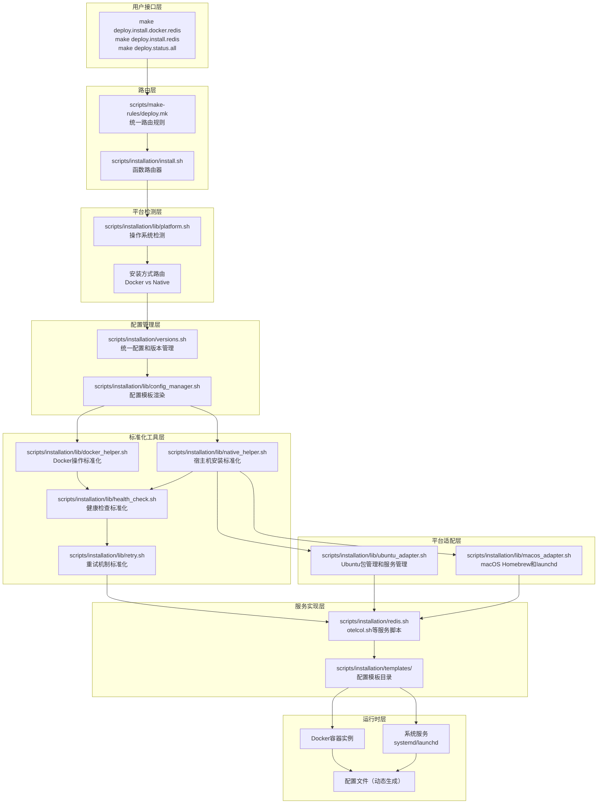
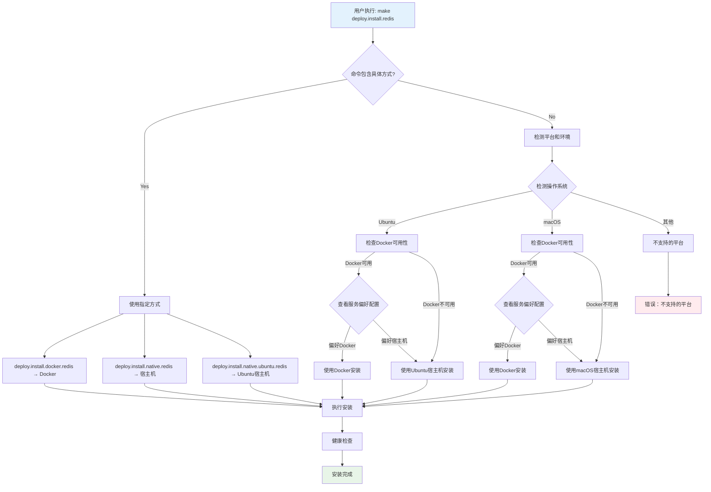

# 设计文档 - Makefile统一入口安装脚本重构

## 概述

本设计旨在重构现有的服务安装脚本系统，建立统一的Makefile入口，标准化Docker容器启动流程，并提供集中化的配置管理。设计基于现有脚本结构（service.sh、install.sh、deploy.mk），通过引入标准化工具库和模板系统来简化维护并提高可扩展性。

## 架构设计

### 整体架构图



## 组件和接口设计

### 1. 平台检测工具库

**文件位置**: `scripts/installation/lib/platform.sh`

#### 核心接口

```bash
# 检测操作系统类型
proj::platform::detect_os() {
    # 返回: "ubuntu", "macos", "unsupported"
}

# 检测是否支持Docker
proj::platform::has_docker() {
    # 返回: 0(支持) 1(不支持)
}

# 获取推荐的安装方式
proj::platform::get_preferred_install_method() {
    local service_name="$1"
    # 返回: "docker", "native"
}

# 检测包管理器
proj::platform::get_package_manager() {
    # Ubuntu: "apt", macOS: "brew"
}
```

### 2. Docker Helper 工具库

**文件位置**: `scripts/installation/lib/docker_helper.sh`

#### 核心接口

```bash
# 统一Docker服务启动函数
proj::docker::run_service() {
    local service_name="$1"        # 服务名称
    local image="$2"               # Docker镜像
    local -n ports_ref=$3          # 端口映射数组引用
    local -n volumes_ref=$4        # 卷映射数组引用  
    local -n env_vars_ref=$5       # 环境变量数组引用
    local extra_args="${6:-}"      # 额外Docker参数
}

# 容器清理函数
proj::docker::cleanup_container() {
    local container_name="$1"
}

# 容器状态检查
proj::docker::check_container_status() {
    local container_name="$1"
}
```

#### 设计特点
- 标准化容器命名：`${NETWORK_NAME}-${service_name}`
- 自动网络配置：所有容器加入统一网络
- 统一重启策略：`unless-stopped`
- 参数化配置：通过数组引用传递动态配置

### 3. 宿主机安装工具库

**文件位置**: `scripts/installation/lib/native_helper.sh`

#### 核心接口

```bash
# 统一宿主机服务安装函数
proj::native::install_service() {
    local service_name="$1"
    local version="$2"
    local config_file="$3"
    
    # 根据平台选择适配器
    case "$(proj::platform::detect_os)" in
        "ubuntu") proj::ubuntu::install_service "$@" ;;
        "macos")  proj::macos::install_service "$@" ;;
        *) return 1 ;;
    esac
}

# 统一服务管理
proj::native::start_service() {
    local service_name="$1"
    case "$(proj::platform::detect_os)" in
        "ubuntu") proj::ubuntu::start_service "$service_name" ;;
        "macos")  proj::macos::start_service "$service_name" ;;
    esac
}

proj::native::stop_service() {
    local service_name="$1"
    case "$(proj::platform::detect_os)" in
        "ubuntu") proj::ubuntu::stop_service "$service_name" ;;
        "macos")  proj::macos::stop_service "$service_name" ;;
    esac
}

# 创建系统用户和目录
proj::native::setup_service_user() {
    local service_name="$1"
    case "$(proj::platform::detect_os)" in
        "ubuntu") proj::ubuntu::setup_user "$service_name" ;;
        "macos")  proj::macos::setup_user "$service_name" ;;
    esac
}
```

### 4. Ubuntu平台适配器

**文件位置**: `scripts/installation/lib/ubuntu_adapter.sh`

#### 核心接口

```bash
# Ubuntu包安装
proj::ubuntu::install_package() {
    local package_name="$1"
    local version="${2:-latest}"
    
    sudo apt update
    if [[ "$version" == "latest" ]]; then
        sudo apt install -y "$package_name"
    else
        sudo apt install -y "$package_name=$version"
    fi
}

# Ubuntu服务安装
proj::ubuntu::install_service() {
    local service_name="$1"
    local version="$2"
    local config_file="$3"
    
    # 1. 安装二进制文件
    proj::ubuntu::download_and_install_binary "$service_name" "$version"
    
    # 2. 创建systemd服务文件
    proj::ubuntu::create_systemd_service "$service_name" "$config_file"
    
    # 3. 启用服务
    sudo systemctl enable "$service_name"
    sudo systemctl daemon-reload
}

# systemd服务管理
proj::ubuntu::start_service() {
    local service_name="$1"
    sudo systemctl start "$service_name"
}

proj::ubuntu::stop_service() {
    local service_name="$1" 
    sudo systemctl stop "$service_name"
}

proj::ubuntu::service_status() {
    local service_name="$1"
    sudo systemctl status "$service_name"
}

# 用户和目录管理
proj::ubuntu::setup_user() {
    local service_name="$1"
    
    # 创建系统用户
    if ! id -u "$service_name" >/dev/null 2>&1; then
        sudo useradd --system --shell /bin/false "$service_name"
    fi
    
    # 创建服务目录
    local service_dirs=(
        "/var/lib/$service_name"
        "/var/log/$service_name"
        "/etc/$service_name"
    )
    
    for dir in "${service_dirs[@]}"; do
        sudo mkdir -p "$dir"
        sudo chown -R "$service_name:$service_name" "$dir"
    done
}
```

### 5. macOS平台适配器

**文件位置**: `scripts/installation/lib/macos_adapter.sh`

#### 核心接口

```bash
# Homebrew包安装
proj::macos::install_package() {
    local package_name="$1"
    local version="${2:-latest}"
    
    if [[ "$version" == "latest" ]]; then
        brew install "$package_name"
    else
        brew install "$package_name@$version"
    fi
}

# macOS服务安装
proj::macos::install_service() {
    local service_name="$1"
    local version="$2"
    local config_file="$3"
    
    # 1. 通过Homebrew安装或手动下载
    if proj::macos::has_brew_formula "$service_name"; then
        proj::macos::install_package "$service_name" "$version"
    else
        proj::macos::download_and_install_binary "$service_name" "$version"
    fi
    
    # 2. 创建launchd服务文件
    proj::macos::create_launchd_service "$service_name" "$config_file"
    
    # 3. 加载服务
    launchctl load ~/Library/LaunchAgents/com.proj.${service_name}.plist
}

# launchd服务管理
proj::macos::start_service() {
    local service_name="$1"
    launchctl start com.proj.${service_name}
}

proj::macos::stop_service() {
    local service_name="$1"
    launchctl stop com.proj.${service_name}
}

proj::macos::service_status() {
    local service_name="$1"
    launchctl list | grep com.proj.${service_name}
}

# 用户和目录管理（macOS适配）
proj::macos::setup_user() {
    local service_name="$1"
    
    # macOS使用当前用户运行服务
    local user_dirs=(
        "$HOME/.config/$service_name"
        "$HOME/.local/share/$service_name"
        "$HOME/.local/var/log/$service_name"
    )
    
    for dir in "${user_dirs[@]}"; do
        mkdir -p "$dir"
    done
}
```

### 6. 配置管理器

**文件位置**: `scripts/installation/lib/config_manager.sh`

#### 核心接口

```bash
# 渲染服务配置模板
proj::config::render_service_template() {
    local service_name="$1"
    local template_name="${2:-config-docker.yaml}"
    local output_dir="${3:-}"  # 可选输出目录覆盖
}

# 注入服务发现变量
proj::config::inject_service_vars() {
    local service_name="$1"
}

# 创建配置目录
proj::config::ensure_config_dir() {
    local service_name="$1"
}
```

#### 配置目录标准
- 使用 `PROJ_${SERVICE}_CONFIG_DIR` 环境变量
- 默认路径：`${PROJ_ROOT_DIR}/_data/${service}/config`
- 自动创建目录结构

### 7. 健康检查系统

**文件位置**: `scripts/installation/lib/health_check.sh`

#### 核心接口

```bash
# 通用健康检查
proj::health::check_service() {
    local service_name="$1"
    local timeout="${2:-30}"
}

# HTTP健康检查
proj::health::check_http() {
    local endpoint="$1"
    local timeout="${2:-30}"
}

# TCP端口检查
proj::health::check_tcp() {
    local host="$1"
    local port="$2"
    local timeout="${3:-10}"
}

# Redis专用检查
proj::health::check_redis_ping() {
    local host="${1:-127.0.0.1}"
    local port="${2:-6379}"
}
```

### 8. 重试机制

**文件位置**: `scripts/installation/lib/retry.sh`

#### 核心接口

```bash
# 指数退避重试
proj::retry::with_backoff() {
    local max_attempts="$1"
    local initial_delay="$2"
    local command="${@:3}"
}

# 线性重试
proj::retry::linear() {
    local max_attempts="$1"
    local delay="$2"
    local command="${@:3}"
}
```

## 数据模型

### 1. 服务配置结构

```bash
# 增强的服务元数据结构
declare -A SERVICE_META=(
    [name]="redis"
    [docker_image]="redis:7.2.4"
    [ports]="6379:6379"
    [dependencies]=""
    [health_check]="redis_ping"
    [config_template]="redis.conf.tpl"
    
    # 平台支持信息
    [docker_supported]="true"
    [ubuntu_supported]="true"
    [macos_supported]="true"
    
    # 宿主机安装信息
    [ubuntu_package]="redis-server"
    [macos_formula]="redis"
    [binary_download_url]=""  # 如果包管理器不支持，使用直接下载
    
    # 服务文件模板
    [systemd_template]="redis.service.tpl"
    [launchd_template]="com.proj.redis.plist.tpl"
)

# 平台安装偏好配置
declare -A INSTALL_PREFERENCES=(
    # 每个服务在不同平台上的推荐安装方式
    [redis_ubuntu]="docker"      # docker|native
    [redis_macos]="native"       # docker|native
    [otelcol_ubuntu]="native"
    [otelcol_macos]="docker"
    [prometheus_ubuntu]="docker"
    [prometheus_macos]="native"
)

# 服务组定义
declare -A SERVICE_GROUPS=(
    [database]="redis mariadb mongodb"
    [observability]="jaeger prometheus grafana otelcol"
    [messaging]="kafka"
    [all]="redis mariadb mongodb jaeger prometheus grafana otelcol kafka"
)
```

### 2. 配置变量层次

```bash
# 第一层：基础配置（versions.sh）
export PROJ_REDIS_VERSION="7.2.4"
export PROJ_REDIS_PORT="6379"

# 第二层：配置目录（扩展versions.sh）
export PROJ_REDIS_CONFIG_DIR="${PROJ_ROOT_DIR}/_data/redis/config"
export PROJ_REDIS_DATA_DIR="${PROJ_ROOT_DIR}/_data/redis/data"

# 第三层：服务发现（动态注入）
export REDIS_ENDPOINT="127.0.0.1:6379"
export VICTORIALOGS_ENDPOINT="127.0.0.1:9428"
```

### 3. 增强的模板目录结构

```
scripts/installation/templates/
├── redis/
│   ├── docker/
│   │   └── redis.conf.tpl                   # Docker容器配置
│   ├── ubuntu/
│   │   ├── redis.conf.tpl                   # Ubuntu系统配置
│   │   └── redis.service.tpl                # systemd服务文件
│   └── macos/
│       ├── redis.conf.tpl                   # macOS系统配置
│       └── com.proj.redis.plist.tpl         # launchd服务文件
├── otelcol/
│   ├── docker/
│   │   └── config-docker.yaml.tpl
│   ├── ubuntu/
│   │   ├── config.yaml.tpl
│   │   └── otelcol.service.tpl
│   └── macos/
│       ├── config.yaml.tpl
│       └── com.proj.otelcol.plist.tpl
├── prometheus/
│   ├── docker/
│   │   └── prometheus.yml.tpl
│   ├── ubuntu/
│   │   ├── prometheus.yml.tpl
│   │   └── prometheus.service.tpl
│   └── macos/
│       ├── prometheus.yml.tpl
│       └── com.proj.prometheus.plist.tpl
└── common/
    ├── docker-compose.yml.tpl               # Docker Compose模板
    ├── systemd-template.service.tpl         # 通用systemd模板
    └── launchd-template.plist.tpl           # 通用launchd模板
```

## 错误处理策略

### 1. 分层错误处理


### 2. 错误分类和处理

```bash
# 网络相关错误 - 可重试
NETWORK_ERRORS=("connection refused" "timeout" "network unreachable")

# 配置错误 - 不可重试  
CONFIG_ERRORS=("permission denied" "file not found" "invalid syntax")

# 资源错误 - 部分可重试
RESOURCE_ERRORS=("disk full" "out of memory" "port already in use")
```

## 测试策略

### 1. 单元测试

**测试工具**: bats (Bash Automated Testing System)

```bash
# tests/unit/docker_helper.bats
@test "proj::docker::run_service creates container with correct name" {
    # 测试容器命名规范
}

@test "proj::docker::run_service handles port mapping correctly" {
    # 测试端口映射逻辑
}

# tests/unit/config_manager.bats  
@test "proj::config::render_service_template generates valid config" {
    # 测试配置模板渲染
}
```

### 2. 集成测试

```bash
# tests/integration/service_lifecycle.bats
@test "deploy redis service end-to-end" {
    # 完整的Redis部署流程测试
    run make deploy.install.docker.redis
    [ "$status" -eq 0 ]
    
    # 验证容器启动
    docker ps | grep proj-redis
    
    # 验证健康检查
    redis-cli ping
}
```

### 3. 性能测试

```bash
# 测试指标
- 服务启动时间 < 30秒
- 健康检查响应时间 < 5秒  
- 配置文件渲染时间 < 1秒
- 新服务添加时间 < 30分钟
```

## 向后兼容性保证

### 1. Makefile命令兼容

```makefile
# 保持现有命令完全兼容
deploy.install.docker.redis         # ✅ 保持不变 - Docker安装
deploy.install.redis                # ✅ 保持不变 - 现在智能选择安装方式
deploy.uninstall.docker.redis       # ✅ 保持不变
deploy.uninstall.redis              # ✅ 保持不变
deploy.status.redis                 # ✅ 保持不变

# 新增平台特定命令（显式指定）
deploy.install.native.redis         # 🆕 强制宿主机安装
deploy.install.native.ubuntu.redis  # 🆕 指定Ubuntu宿主机安装
deploy.install.native.macos.redis   # 🆕 指定macOS宿主机安装

# 扩展批量操作（新增）
deploy.install.docker.database      # 🆕 批量Docker安装数据库服务
deploy.install.native.database      # 🆕 批量宿主机安装数据库服务
deploy.install.database             # 🆕 智能选择安装方式的批量安装
deploy.status.all                   # 🆕 检查所有服务状态
```

### 2. 脚本接口兼容

```bash
# 现有调用方式保持支持
./scripts/installation/redis.sh proj::redis::docker::install  # ✅ 兼容
./scripts/installation/redis.sh proj::redis::install          # ✅ 兼容（现在支持智能选择）
./scripts/installation/service.sh start redis                # ✅ 兼容

# 新增标准化调用（推荐）  
proj::docker::run_service redis redis:7.2.4 ...             # 🆕 推荐 - Docker安装
proj::native::install_service redis 7.2.4 config.conf      # 🆕 推荐 - 宿主机安装

# 新增平台特定调用
./scripts/installation/redis.sh proj::redis::native::install   # 🆕 强制宿主机安装
./scripts/installation/redis.sh proj::redis::ubuntu::install   # 🆕 Ubuntu特定安装
./scripts/installation/redis.sh proj::redis::macos::install    # 🆕 macOS特定安装
```

### 3. 配置文件兼容

```bash
# 现有配置变量保持支持
PROJ_REDIS_VERSION     # ✅ 保持不变
PROJ_REDIS_PORT        # ✅ 保持不变

# 新增配置目录变量
PROJ_REDIS_CONFIG_DIR  # 🆕 新增，有默认值
```

## 实施策略

### 阶段1: 基础设施和平台支持 (4天)

1. 创建 `scripts/installation/lib/` 目录结构
2. 实现平台检测工具库 (`platform.sh`)
3. 实现Ubuntu和macOS平台适配器
4. 创建增强的模板目录结构（支持Docker/Ubuntu/macOS）
5. 扩展 `versions.sh` 增加平台相关配置变量

### 阶段2: 双模式核心服务迁移 (6天)

1. 迁移 Redis 服务支持Docker和宿主机双模式（验证方案）
   - 实现智能安装方式选择逻辑
   - 测试Ubuntu systemd集成
   - 测试macOS launchd集成
2. 迁移 OTEL Collector 服务（复杂配置验证）
   - 支持不同平台的配置模板
   - 测试平台特定的配置路径
3. 转换现有配置文件为多平台模板格式
4. 更新 Makefile 路由支持新的命令格式

### 阶段3: 批量操作和跨平台测试 (5天)

1. 实现服务组批量操作（支持混合安装方式）
2. 添加平台特定的健康检查覆盖
3. 编写跨平台单元测试和集成测试
   - Ubuntu Docker + 宿主机测试
   - macOS Docker + 宿主机测试
   - 混合环境测试
4. 性能基准测试（不同安装方式对比）

### 阶段4: 文档、模板和最佳实践 (4天)

1. 创建平台感知的新服务添加模板
2. 更新项目文档，包括平台选择指南
3. 编写跨平台最佳实践指南
4. 创建平台迁移指南（Docker -> 宿主机，反之亦然）
5. 团队培训材料

## 智能安装方式选择流程



这个增强的设计现在完全支持：

- **多平台支持**: Ubuntu (systemd) 和 macOS (launchd)
- **双安装模式**: Docker 容器和宿主机原生安装
- **智能选择**: 基于平台和可用性的自动安装方式选择
- **完全兼容**: 保持所有现有命令和脚本接口不变
- **灵活扩展**: 易于添加新平台和新服务

设计确保了系统的可维护性、可扩展性、跨平台兼容性和向后兼容性，为项目的长期发展奠定坚实基础。