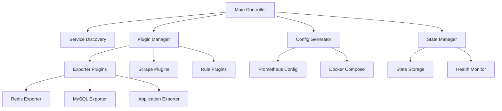

# Prometheus 模块重构设计文档

## 概述

本设计文档描述了 Prometheus 监控模块的完整重构方案，采用插件化架构实现模块化、可扩展的监控系统。

## 架构设计

### 整体架构



### 核心组件

#### 1. 主控制器 (Main Controller)
负责协调所有组件的工作流程，提供统一的入口点。

**职责**:
- 初始化各个管理器
- 协调组件间的依赖关系
- 提供命令行接口
- 错误处理和日志记录

#### 2. 服务发现 (Service Discovery)
自动发现运行中的服务，为监控配置提供基础数据。

**职责**:
- 扫描 Docker 容器
- 识别服务类型和版本
- 提取连接信息
- 维护服务状态缓存

#### 3. 插件管理器 (Plugin Manager)
管理所有监控插件的生命周期。

**职责**:
- 插件发现和加载
- 插件依赖管理
- 插件状态监控
- 插件间通信

#### 4. 配置生成器 (Config Generator)
根据发现的服务和插件配置生成最终的 Prometheus 配置。

**职责**:
- 合并多个配置文件
- 模板渲染和变量替换
- 配置验证
- 配置版本管理

#### 5. 状态管理器 (State Manager)
管理系统状态的持久化和查询。

**职责**:
- 状态文件读写
- 状态变更通知
- 状态恢复
- 健康检查

## 插件架构设计

### 插件类型

#### 1. Exporter 插件
负责特定服务的 exporter 管理。

```bash
# 插件接口规范
exporter_plugin_redis() {
    # 必需方法
    detect()      # 检测目标服务
    install()     # 安装 exporter
    uninstall()   # 卸载 exporter
    status()      # 检查状态
    health()      # 健康检查
    
    # 可选方法
    configure()   # 自定义配置
    validate()    # 配置验证
}
```

#### 2. Scrape 配置插件
为特定服务生成 Prometheus scrape 配置。

```bash
# 插件接口规范
scrape_plugin_redis() {
    # 必需方法
    generate_config()   # 生成配置
    validate_config()   # 验证配置
    
    # 插件元数据
    get_plugin_info()   # 插件信息
    get_dependencies()  # 依赖关系
}
```

#### 3. 规则插件
为特定服务生成告警规则。

```bash
# 插件接口规范
rule_plugin_redis() {
    # 必需方法
    generate_rules()    # 生成规则
    validate_rules()    # 验证规则
    
    # 可选方法
    get_thresholds()    # 获取阈值配置
    customize_rules()   # 自定义规则
}
```

## 目录结构设计

```
prometheus/
├── prometheus-manager.sh              # 主控制器脚本
├── lib/                               # 核心库文件
│   ├── core.sh                           # 核心函数库
│   ├── service-discovery.sh              # 服务发现
│   ├── plugin-manager.sh                 # 插件管理器
│   ├── config-generator.sh               # 配置生成器
│   ├── state-manager.sh                  # 状态管理器
│   ├── docker-helper.sh                  # Docker 辅助函数
│   └── validation.sh                     # 配置验证
├── plugins/                           # 插件目录
│   ├── exporters/                        # Exporter 插件
│   │   ├── base-exporter.sh                 # 基础 exporter 类
│   │   ├── redis-exporter.sh                # Redis exporter 插件
│   │   ├── mysql-exporter.sh                # MySQL exporter 插件
│   │   ├── application-exporter.sh          # 应用程序 exporter 插件
│   │   └── plugin-template.sh               # 新插件模板
│   ├── scrapes/                          # Scrape 配置插件
│   │   ├── base-scrape.sh                   # 基础 scrape 类
│   │   ├── redis-scrape.sh                  # Redis scrape 插件
│   │   ├── mysql-scrape.sh                  # MySQL scrape 插件
│   │   └── application-scrape.sh            # 应用程序 scrape 插件
│   └── rules/                            # 规则插件
│       ├── base-rule.sh                     # 基础规则类
│       ├── redis-rule.sh                    # Redis 规则插件
│       ├── mysql-rule.sh                    # MySQL 规则插件
│       └── application-rule.sh              # 应用程序规则插件
├── templates/                         # 配置模板
│   ├── prometheus/                       # Prometheus 配置模板
│   │   ├── prometheus-base.yml.tpl          # 基础配置模板
│   │   └── docker-compose.yml.tpl           # Docker Compose 模板
│   ├── scrape-configs/                   # Scrape 配置模板
│   │   ├── application.yml.tpl              # 应用服务配置
│   │   ├── redis.yml.tpl                    # Redis 配置
│   │   └── mysql.yml.tpl                    # MySQL 配置
│   └── rules/                            # 规则模板
│       ├── application-rules.yml.tpl        # 应用规则
│       ├── redis-rules.yml.tpl              # Redis 规则
│       └── mysql-rules.yml.tpl              # MySQL 规则
├── config/                            # 配置文件
│   ├── prometheus-manager.conf           # 主配置文件
│   ├── plugin-registry.conf              # 插件注册表
│   └── service-mappings.conf             # 服务映射配置
├── state/                             # 状态文件
│   ├── services.state                    # 服务状态
│   ├── plugins.state                     # 插件状态
│   └── config.state                      # 配置状态
├── scripts/                           # 辅助脚本
│   ├── install.sh                        # 安装脚本
│   ├── uninstall.sh                      # 卸载脚本
│   ├── status.sh                         # 状态检查脚本
│   └── migrate.sh                        # 迁移脚本
└── tests/                             # 测试文件
    ├── unit/                             # 单元测试
    ├── integration/                      # 集成测试
    └── fixtures/                         # 测试数据
```

## 组件详细设计

### 1. 主控制器 (prometheus-manager.sh)

主控制器提供统一的命令行接口和流程控制。

**命令接口**:
```bash
./prometheus-manager.sh start [options]
./prometheus-manager.sh stop [options]
./prometheus-manager.sh status [service...]
./prometheus-manager.sh reload
./prometheus-manager.sh install-plugin <plugin_name>
./prometheus-manager.sh remove-plugin <plugin_name>
./prometheus-manager.sh list-plugins
./prometheus-manager.sh validate-config
```

**核心功能**:
- 命令解析和参数验证
- 组件初始化和依赖检查
- 错误处理和日志记录
- 状态管理和持久化

### 2. 服务发现 (service-discovery.sh)

**核心函数**:
```bash
discover_running_services() {
    # 扫描 Docker 容器
    # 识别服务类型
    # 提取连接信息
    # 返回服务清单
}

get_service_info() {
    local service_name="$1"
    # 获取服务详细信息
    # IP地址、端口、版本等
}

is_service_healthy() {
    local service_name="$1"
    # 检查服务健康状态
    # 返回 true/false
}
```

### 3. 插件管理器 (plugin-manager.sh)

**核心函数**:
```bash
load_plugins() {
    # 扫描插件目录
    # 加载插件元数据
    # 检查插件依赖
    # 注册插件到系统
}

execute_plugin_method() {
    local plugin_name="$1"
    local method="$2"
    shift 2
    # 执行插件方法
    # 错误处理
    # 状态记录
}

get_plugin_dependencies() {
    local plugin_name="$1"
    # 获取插件依赖关系
    # 返回依赖列表
}
```

### 4. 配置生成器 (config-generator.sh)

**核心函数**:
```bash
generate_prometheus_config() {
    # 加载基础配置模板
    # 收集所有scrape配置
    # 收集所有规则文件
    # 合并生成最终配置
    # 验证配置语法
}

merge_scrape_configs() {
    # 遍历所有启用的scrape插件
    # 调用插件生成配置
    # 合并到主配置文件
}

validate_final_config() {
    # 使用promtool验证配置
    # 检查端口冲突
    # 验证服务连通性
}
```

### 5. 状态管理器 (state-manager.sh)

**状态文件格式**:
```json
{
  "timestamp": "2025-09-02T10:00:00Z",
  "version": "2.0.0",
  "services": {
    "redis": {
      "status": "running",
      "container_name": "proj-redis",
      "exporter_status": "running",
      "monitoring_enabled": true,
      "last_check": "2025-09-02T09:59:00Z"
    }
  },
  "plugins": {
    "redis-exporter": {
      "loaded": true,
      "version": "1.0.0",
      "dependencies_met": true
    }
  },
  "config": {
    "last_generated": "2025-09-02T09:58:00Z",
    "checksum": "abc123def456"
  }
}
```

**核心函数**:
```bash
save_state() {
    # 序列化当前状态
    # 写入状态文件
    # 原子操作保证一致性
}

load_state() {
    # 从状态文件读取
    # 反序列化状态数据
    # 验证状态完整性
}

update_service_state() {
    local service_name="$1"
    local status="$2"
    # 更新特定服务状态
    # 触发状态变更事件
}
```

## 插件开发指南

### 基础插件类

每种类型的插件都有对应的基础类，提供通用功能。

#### Exporter 基础类 (base-exporter.sh)

```bash
# 基础 exporter 插件类
base_exporter_plugin() {
    local plugin_name="$1"
    
    # 通用属性
    PLUGIN_NAME="$plugin_name"
    PLUGIN_TYPE="exporter"
    PLUGIN_VERSION="1.0.0"
    
    # 通用方法
    base_detect() {
        # 通用服务检测逻辑
        local service_name="${PROJ_PREFIX}-${plugin_name}"
        docker ps --filter name="$service_name" --format "{{.Names}}" | grep -q "$service_name"
    }
    
    base_health_check() {
        # 通用健康检查逻辑
        local port="$1"
        curl -s "http://localhost:${port}/metrics" >/dev/null 2>&1
    }
    
    base_cleanup() {
        # 通用清理逻辑
        local container_name="${PROJ_PREFIX}-${plugin_name}-exporter"
        docker stop "$container_name" 2>/dev/null || true
        docker rm "$container_name" 2>/dev/null || true
    }
}
```

### 具体插件实现示例

#### Redis Exporter 插件 (redis-exporter.sh)

```bash
#!/usr/bin/env bash
# Redis Exporter 插件

# 继承基础类
source "$(dirname "$0")/base-exporter.sh"

# 插件元数据
readonly REDIS_PLUGIN_NAME="redis"
readonly REDIS_EXPORTER_IMAGE="oliver006/redis_exporter:latest"
readonly REDIS_EXPORTER_PORT="9121"

# 初始化插件
redis_exporter_init() {
    base_exporter_plugin "$REDIS_PLUGIN_NAME"
}

# 检测 Redis 服务
redis_exporter_detect() {
    local service_name="${PROJ_PREFIX}-redis"
    
    echo "🔍 检测Redis服务..."
    
    if base_detect; then
        export REDIS_SERVICE_DETECTED=true
        export REDIS_SERVICE_NAME="$service_name"
        echo "✅ 发现Redis服务: $service_name"
        return 0
    else
        export REDIS_SERVICE_DETECTED=false
        echo "⚠️  Redis服务未运行"
        return 1
    fi
}

# 安装 Redis exporter
redis_exporter_install() {
    local service_name="$REDIS_SERVICE_NAME"
    local exporter_name="${PROJ_PREFIX}-redis-exporter"
    
    echo "🚀 安装Redis exporter..."
    
    # 构造连接字符串
    local redis_addr="redis://${service_name}:6379"
    if [[ -n "${REDIS_PASSWORD}" && "${REDIS_PASSWORD}" != "" ]]; then
        redis_addr="redis://:${REDIS_PASSWORD}@${service_name}:6379"
    fi
    
    # 停止现有容器
    base_cleanup
    
    # 启动新容器
    docker run -d \
        --name "$exporter_name" \
        --network "${PROJ_NETWORK_NAME}" \
        --restart unless-stopped \
        -p "${REDIS_EXPORTER_PORT}:9121" \
        -e REDIS_ADDR="$redis_addr" \
        -e PROJ_SERVICE_NAME="redis-exporter" \
        -e PROJ_SERVICE_VERSION="latest" \
        --label "prometheus.monitor=true" \
        --label "prometheus.port=9121" \
        --label "prometheus.path=/metrics" \
        "${REDIS_EXPORTER_IMAGE}" \
        --redis.addr="$redis_addr"
    
    # 等待启动
    sleep 3
    
    if redis_exporter_health; then
        echo "✅ Redis exporter安装成功"
        update_service_state "redis" "exporter_running"
        return 0
    else
        echo "❌ Redis exporter安装失败"
        return 1
    fi
}

# 卸载 Redis exporter
redis_exporter_uninstall() {
    echo "🗑️  卸载Redis exporter..."
    base_cleanup
    update_service_state "redis" "exporter_stopped"
    echo "✅ Redis exporter卸载完成"
}

# 健康检查
redis_exporter_health() {
    base_health_check "$REDIS_EXPORTER_PORT"
}

# 获取状态
redis_exporter_status() {
    local container_name="${PROJ_PREFIX}-redis-exporter"
    
    if docker ps --filter name="$container_name" --format "{{.Names}}" | grep -q "$container_name"; then
        echo "running"
    else
        echo "stopped"
    fi
}

# 获取配置信息
redis_exporter_get_config() {
    cat << EOF
{
    "service_name": "${REDIS_SERVICE_NAME}",
    "exporter_port": ${REDIS_EXPORTER_PORT},
    "metrics_path": "/metrics",
    "scrape_interval": "15s"
}
EOF
}

# 插件信息
redis_exporter_plugin_info() {
    cat << EOF
{
    "name": "redis-exporter",
    "type": "exporter",
    "version": "1.0.0",
    "description": "Redis metrics exporter for Prometheus",
    "dependencies": ["redis"],
    "ports": [${REDIS_EXPORTER_PORT}],
    "image": "${REDIS_EXPORTER_IMAGE}"
}
EOF
}

# 如果直接执行此脚本
if [[ "${BASH_SOURCE[0]}" == "${0}" ]]; then
    redis_exporter_init
    
    case "${1:-}" in
        "detect")   redis_exporter_detect ;;
        "install")  redis_exporter_install ;;
        "uninstall") redis_exporter_uninstall ;;
        "status")   redis_exporter_status ;;
        "health")   redis_exporter_health ;;
        "info")     redis_exporter_plugin_info ;;
        *)          echo "用法: $0 {detect|install|uninstall|status|health|info}" ;;
    esac
fi
```

## 错误处理设计

### 错误分类

1. **系统错误**: Docker 不可用、权限不足等
2. **配置错误**: 配置文件语法错误、参数缺失等  
3. **服务错误**: 目标服务不可达、认证失败等
4. **插件错误**: 插件加载失败、依赖不满足等

### 错误处理机制

```bash
# 错误处理函数库
handle_error() {
    local error_type="$1"
    local error_message="$2"
    local error_context="$3"
    
    # 记录错误日志
    log_error "$error_type" "$error_message" "$error_context"
    
    # 根据错误类型执行相应的处理
    case "$error_type" in
        "SYSTEM_ERROR")
            # 系统错误：记录并退出
            echo "❌ 系统错误: $error_message"
            exit 1
            ;;
        "CONFIG_ERROR")
            # 配置错误：提供修复建议
            echo "⚠️  配置错误: $error_message"
            echo "💡 建议: $error_context"
            return 1
            ;;
        "SERVICE_ERROR")
            # 服务错误：跳过并继续
            echo "⚠️  服务错误: $error_message"
            echo "ℹ️  跳过此服务，继续处理其他服务"
            return 0
            ;;
        "PLUGIN_ERROR")
            # 插件错误：禁用插件
            echo "⚠️  插件错误: $error_message"
            disable_plugin "$error_context"
            return 0
            ;;
    esac
}

# 重试机制
retry_with_backoff() {
    local max_attempts="$1"
    local delay="$2"
    shift 2
    local command=("$@")
    
    local attempt=1
    while [[ $attempt -le $max_attempts ]]; do
        if "${command[@]}"; then
            return 0
        fi
        
        if [[ $attempt -lt $max_attempts ]]; then
            echo "⏳ 第 $attempt 次尝试失败，等待 ${delay}s 后重试..."
            sleep "$delay"
            delay=$((delay * 2))  # 指数退避
        fi
        
        ((attempt++))
    done
    
    return 1
}
```

## 配置管理设计

### 配置层次结构

1. **默认配置**: 内置默认值
2. **主配置文件**: prometheus-manager.conf
3. **环境变量**: 运行时覆盖
4. **命令行参数**: 最高优先级

### 配置文件格式

```ini
# prometheus-manager.conf
[global]
project_prefix = proj
network_name = proj-network
config_dir = /tmp/_thirdparty/prometheus/config
data_dir = /tmp/_thirdparty/prometheus/data
log_level = info
max_retries = 3

[prometheus]
version = 2.54.1
port = 9090
retention_time = 15d
retention_size = 10GB
enable_lifecycle = true

[exporters]
auto_discover = true
health_check_timeout = 10
startup_delay = 5

[redis]
exporter_image = oliver006/redis_exporter:latest
exporter_port = 9121
scrape_interval = 15s

[mysql]
exporter_image = prom/mysqld-exporter:latest
exporter_port = 9104
scrape_interval = 15s
```

## 测试策略

### 单元测试

针对每个核心函数编写单元测试。

```bash
# tests/unit/service-discovery.bats
#!/usr/bin/env bats

setup() {
    source "$BATS_TEST_DIRNAME/../../lib/service-discovery.sh"
}

@test "discover_running_services should detect running Redis" {
    # Mock docker ps command
    docker() {
        if [[ "$1" == "ps" ]]; then
            echo "proj-redis"
        fi
    }
    export -f docker
    
    run discover_running_services
    [ "$status" -eq 0 ]
    [[ "$output" =~ "redis" ]]
}
```

### 集成测试

测试完整的工作流程。

```bash
# tests/integration/full-stack.bats
#!/usr/bin/env bats

@test "full stack deployment should work end-to-end" {
    # 启动测试服务
    docker run -d --name test-redis redis:latest
    
    # 运行 prometheus-manager
    run ./prometheus-manager.sh start
    [ "$status" -eq 0 ]
    
    # 验证 Prometheus 可访问
    run curl -s http://localhost:9090/-/healthy
    [ "$status" -eq 0 ]
    
    # 验证 targets
    run curl -s http://localhost:9090/api/v1/targets
    [[ "$output" =~ "redis-exporter" ]]
    
    # 清理
    ./prometheus-manager.sh stop
    docker stop test-redis && docker rm test-redis
}
```

## 迁移策略

### 平滑迁移方案

1. **并行运行**: 新旧系统并行运行一段时间
2. **渐进式迁移**: 逐个服务迁移到新系统
3. **回滚机制**: 提供快速回滚到旧系统的能力

### 迁移脚本

```bash
#!/usr/bin/env bash
# migrate.sh - 迁移脚本

migrate_to_new_architecture() {
    echo "🔄 开始迁移到新架构..."
    
    # 1. 备份现有配置
    backup_existing_config
    
    # 2. 停止旧系统
    stop_old_system
    
    # 3. 导入现有配置
    import_existing_config
    
    # 4. 启动新系统
    start_new_system
    
    # 5. 验证迁移结果
    validate_migration
    
    echo "✅ 迁移完成"
}

validate_migration() {
    echo "🔍 验证迁移结果..."
    
    # 检查所有目标是否正常
    if curl -s http://localhost:9090/api/v1/targets | jq -r '.data.activeTargets[].health' | grep -v "up" > /dev/null; then
        echo "❌ 部分监控目标不健康"
        return 1
    fi
    
    echo "✅ 所有监控目标正常"
    return 0
}
```

## 性能优化

### 启动性能优化

1. **并行检测**: 并行检测多个服务状态
2. **缓存机制**: 缓存服务发现结果
3. **延迟加载**: 按需加载插件

### 运行时性能优化

1. **健康检查优化**: 合理的检查间隔和超时
2. **配置更新优化**: 仅在必要时重新生成配置
3. **状态管理优化**: 批量更新状态

## 可扩展性设计

### 新服务支持

添加新服务监控只需要：

1. 创建对应的插件文件
2. 定义配置模板
3. 注册到插件系统

### 新功能扩展

系统支持以下扩展点：

1. **自定义服务发现**: 支持除 Docker 外的其他容器编排系统
2. **自定义配置生成**: 支持不同的配置格式和模板引擎
3. **自定义状态存储**: 支持除文件外的其他存储后端
4. **自定义通知机制**: 支持状态变更通知

这个设计方案提供了一个完整、模块化、可扩展的 Prometheus 监控系统架构，解决了现有系统的所有问题，并为未来的扩展留下了充足的空间。