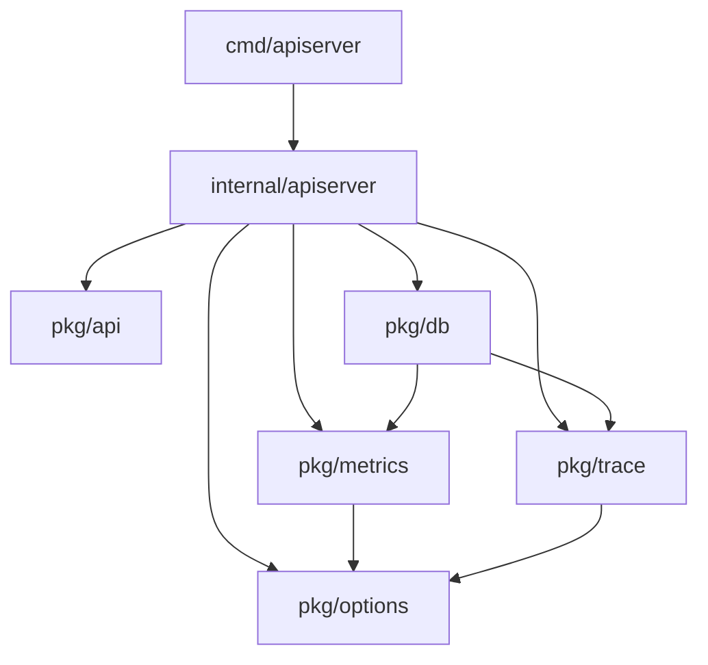
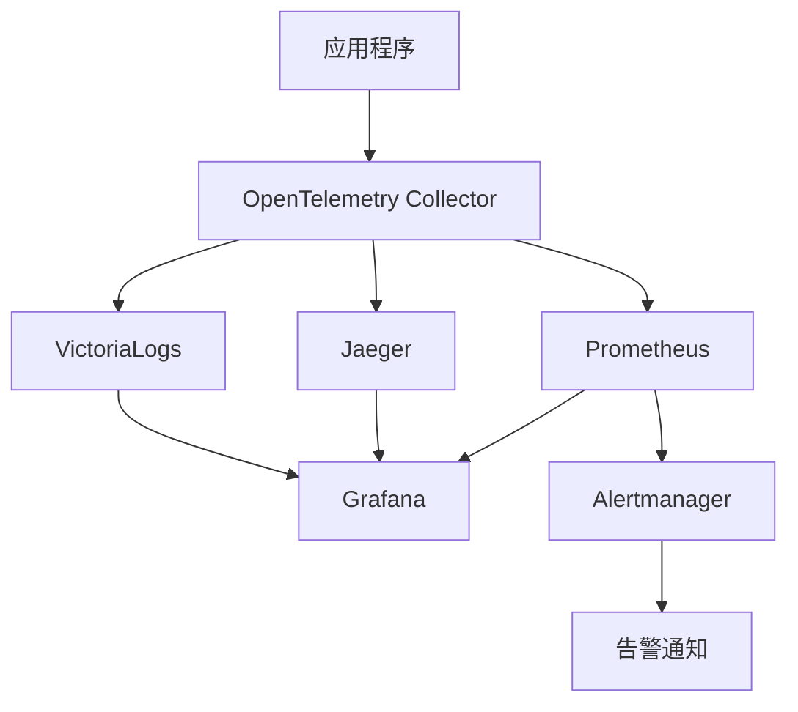

# Go-Protoc

基于 Kratos v2 构建的生产就绪 Go 微服务框架，以 Protocol Buffers 为统一数据源。采用清洁架构与 Wire 依赖注入，支持 HTTP/gRPC API，具备完整的错误处理、国际化、认证和可观测性功能。

[](https://golang.org)
[](https://go-kratos.dev)
[](LICENSE)
[](https://opentelemetry.io)

## 📋 目录

- [功能特性](#功能特性)
- [快速开始](#快速开始)
- [项目架构](#项目架构)
- [核心包说明](#核心包说明)
- [基础设施](#基础设施)
- [开发指南](#开发指南)
- [生产部署](#生产部署)

## 🎯 功能特性

### 核心特性

- 🏗️ **清洁架构**: 分层架构设计，依赖倒置，易于测试和维护
- 🔌 **依赖注入**: 基于Wire的编译时依赖注入，高性能零反射
- 📡 **双协议支持**: HTTP REST + gRPC API，自动生成客户端代码
- 🛡️ **完整安全**: JWT认证，TLS加密，RBAC权限控制
- 🌐 **国际化**: 多语言支持，动态语言切换
- 📊 **可观测性**: Prometheus监控，Jaeger链路追踪，结构化日志
- 🔧 **配置管理**: 环境变量，配置文件，命令行参数统一管理

### 技术栈

- **框架**: Kratos v2，Gin，gRPC
- **数据库**: MySQL，PostgreSQL，MongoDB，Redis
- **消息队列**: Kafka，RabbitMQ
- **可观测性**: Prometheus，Jaeger，Grafana，VictoriaLogs
- **基础设施**: Docker，Kubernetes，etcd，Consul

## 🚀 快速开始

### 环境要求

- Go 1.21+
- Docker & Docker Compose
- Make

### 安装开发工具

```bash
# 安装所有开发工具
make install-tools A=1

# 安装特定工具
make tools.install.wire     # Wire依赖注入
make tools.install.buf      # Protocol Buffers工具
make tools.install.golangci-lint  # 代码检查工具
```

### 启动开发环境

```bash
# 完整开发环境设置（工具+服务+代码生成）
make dev-setup

# 快速开发启动（跳过工具安装）
make dev-quick

# 启动API服务器
make run-api

# 构建项目
make build
```

### 基础使用示例

```go
package main

import (
    "github.com/costa92/go-protoc/v2/pkg/db"
    "github.com/costa92/go-protoc/v2/pkg/options"
    "github.com/costa92/go-protoc/v2/pkg/metrics"
    "github.com/costa92/go-protoc/v2/pkg/trace"
)

func main() {
    // 1. 配置数据库
    mysqlOpts := options.NewMySQLOptions()
    mysqlOpts.EnableMetrics = true
    mysqlOpts.EnableTrace = true

    // 2. 初始化追踪
    traceConfig := trace.TracerConfig{
        ServiceName: "my-service",
        Endpoint:    "http://localhost:14268/api/traces",
        Environment: "development",
    }
    trace.InitializeGlobalTracer(traceConfig)

    // 3. 启动监控
    metricsManager, _ := metrics.StartMetrics("my-service",
        metrics.WithHTTP(true, 8080),
        metrics.WithDatabase(true, metrics.DatabaseInfo{
            Name: "main", Type: "mysql", Endpoint: "localhost:3306",
        }),
    )
    defer metricsManager.Stop()

    // 4. 创建数据库连接
    db, err := mysqlOpts.NewDB()
    if err != nil {
        panic(err)
    }

    // 5. 注册到监控系统
    metrics.RegisterDatabase("main", db)
}
```

## 🏗️ 项目架构

### 整体架构

```
cmd/apiserver/          → 应用入口点
├── main.go            → 主程序入口
└── app/               → 应用配置和启动逻辑

internal/apiserver/     → 核心业务逻辑
├── handler/           → HTTP/gRPC处理器（交付层）
├── biz/               → 用例（应用层）
├── store/             → 数据访问（基础设施层）
└── config/            → 配置管理

pkg/                   → 可重用包（对外导出）
├── api/               → Protobuf定义和生成代码
├── db/                → 数据库连接和管理
├── metrics/           → 统一指标收集系统
├── trace/             → 分布式链路追踪
├── options/           → 配置选项管理
├── errorsx/           → 上下文感知错误系统
├── authn/             → JWT身份认证
└── server/            → HTTP/gRPC服务器配置
```

### 依赖关系



## 📦 核心包说明

### [pkg/db](./pkg/db/README.md) - 数据库管理

提供统一的数据库连接抽象层，支持多种数据库类型。

**核心功能**:

- MySQL、PostgreSQL、Redis连接管理
- 连接池监控和优化
- 事务支持和错误处理
- 指标收集和链路追踪集成

**快速使用**:

```go
// 创建MySQL连接
opts := &db.MySQLOptions{
    Addr: "localhost:3306",
    EnableMetrics: true,
    EnableTrace: true,
}
db, err := db.NewMySQL(opts)
```

### [pkg/metrics](./pkg/metrics/README.md) - 统一指标系统

完整的指标收集和管理系统，支持HTTP、gRPC、数据库等组件监控。

**核心功能**:

- HTTP/gRPC/数据库/Redis指标收集
- Prometheus标准指标导出
- 自定义业务指标支持
- 健康检查和状态监控

**快速使用**:

```go
// 启动指标收集
manager, _ := metrics.StartMetrics("my-service",
    metrics.WithHTTP(true, 8080),
    metrics.WithGRPC(true),
)

// 记录指标
metrics.RecordHTTPRequest("GET", "/api/users", 200, time.Millisecond*150)
```

### [pkg/trace](./pkg/trace/README.md) - 分布式追踪

基于OpenTelemetry的分布式链路追踪系统。

**核心功能**:

- Jaeger链路追踪集成
- 数据库操作自动追踪
- 微服务调用链可视化
- 性能瓶颈分析

**快速使用**:

```go
// 初始化追踪器
config := trace.TracerConfig{
    ServiceName: "my-service",
    Endpoint: "http://localhost:14268/api/traces",
}
trace.InitializeGlobalTracer(config)

// 创建span
ctx, span := trace.StartSpan(ctx, "my-operation")
defer span.End()
```

### [pkg/options](./pkg/options/README.md) - 配置管理

统一的配置选项管理系统，支持命令行参数和配置文件。

**核心功能**:

- 多种组件配置选项（数据库、服务、中间件）
- 命令行参数自动生成
- 配置验证和默认值
- 环境变量支持

**快速使用**:

```go
// 创建配置选项
mysqlOpts := options.NewMySQLOptions()
httpOpts := options.NewHTTPOptions()

// 添加命令行参数
fs := pflag.NewFlagSet("myapp", pflag.ExitOnError)
mysqlOpts.AddFlags(fs, "db")
httpOpts.AddFlags(fs, "server")

// 创建组件
db, _ := mysqlOpts.NewDB()
server, _ := httpOpts.NewServer()
```

## 🏗️ 基础设施

项目集成了完整的微服务基础设施栈，支持一键安装和管理。

### 数据存储层

| 组件 | 版本 | 端口 | 用途 |
|------|------|------|------|
| Redis | 7.2.4 | 6379 | 高性能缓存服务 |
| MariaDB | 11.2.2 | 3306 | MySQL兼容的关系型数据库 |
| MongoDB | 7.0.5 | 27017 | NoSQL文档数据库 |
| etcd | v3.5.12 | 2379 | 分布式键值存储，服务发现 |

### 消息传输层

| 组件 | 版本 | 端口 | 用途 |
|------|------|------|------|
| Kafka | 3.6.1 | 9092 | 分布式消息队列，事件流处理 |

### 可观测性栈

| 组件 | 版本 | 端口 | Web UI |
|------|------|------|--------|
| Jaeger | 1.52.0 | 14268/16686 | [链路追踪UI](http://127.0.0.1:16686) |
| Prometheus | 2.48.1 | 9090 | [监控查询](http://127.0.0.1:9090) |
| Grafana | 10.2.4 | 3000 | [监控面板](http://127.0.0.1:3000) |
| Alertmanager | 0.26.0 | 9093 | [告警管理](http://127.0.0.1:9093) |
| OpenTelemetry Collector | 0.91.0 | 4317/4318 | 统一遥测数据收集 |
| VictoriaLogs | v0.5.2 | 9428 | [日志查询](http://127.0.0.1:9428) |

### 服务管理命令

```bash
# 启动所有服务
make start-all

# 启动特定服务组
make start-database      # 启动数据库服务组
make start-observability # 启动可观测性服务组

# 启动单个服务
make run-redis
make run-mysql
make run-jaeger
make run-prometheus

# 停止服务
make stop-all
make stop-redis
make stop-mysql

# 查看服务状态
make status-all

# 查看服务日志
make logs-all
```

### 可观测性数据流



## 🛠️ 开发指南

### 常用命令

```bash
# 开发环境
make dev-setup          # 完整开发环境设置
make dev-clean          # 清理开发环境
make dev-quick          # 快速开发启动
make dev-watch          # 文件监控与自动重构建
make dev-test           # 完整测试流水线

# 代码生成
make generate           # 生成protobuf/gRPC/HTTP代码
make wire              # 重新生成依赖注入代码
buf generate           # 直接protobuf生成

# 构建和测试
make build             # 构建优化二进制文件
make test              # 运行所有测试
make fmt               # 格式化代码
make tidy              # 清理依赖
```

### 添加新功能

1. **定义API**: 在`pkg/api/apiserver/v1/`中定义protobuf
2. **生成代码**: 运行`make generate`
3. **实现处理器**: 在`internal/apiserver/handler/`中实现
4. **添加业务逻辑**: 在`internal/apiserver/biz/`中实现
5. **数据访问**: 在`internal/apiserver/store/`中实现
6. **注册依赖**: 更新`internal/apiserver/wire.go`
7. **运行Wire**: 执行`make wire`

### 配置管理

**环境配置**:

```bash
# 复制配置模板
cp configs/apiserver.yaml configs/apiserver_local.yaml

# 编辑本地配置
vim configs/apiserver_local.yaml

# 使用配置启动
go run cmd/apiserver/main.go -c configs/apiserver_local.yaml
```

**配置结构**:

```yaml
# configs/apiserver.yaml
server:
  http:
    addr: 0.0.0.0:8000
    timeout: 1s
  grpc:
    addr: 0.0.0.0:9000
    timeout: 1s

data:
  database:
    driver: mysql
    source: user:password@tcp(127.0.0.1:3306)/dbname
  redis:
    addr: 127.0.0.1:6379
    read_timeout: 0.2s
    write_timeout: 0.2s

trace:
  endpoint: http://127.0.0.1:14268/api/traces
```

### 测试策略

```bash
# 单元测试
go test ./internal/apiserver/biz/...

# 集成测试
make run-redis  # 启动依赖服务
go test -tags=integration ./internal/apiserver/store/...

# 性能测试
go test -bench=. ./internal/apiserver/...

# 覆盖率测试
make dev-test
```

## 🚀 生产部署

### Docker部署

```bash
# 构建镜像
make docker-build

# 运行容器
docker run -d --name apiserver \
  -p 8000:8000 \
  -p 9000:9000 \
  -e DATABASE_URL=mysql://... \
  -e REDIS_URL=redis://... \
  apiserver:latest
```

### Kubernetes部署

```yaml
# k8s/deployment.yaml
apiVersion: apps/v1
kind: Deployment
metadata:
  name: apiserver
spec:
  replicas: 3
  selector:
    matchLabels:
      app: apiserver
  template:
    metadata:
      labels:
        app: apiserver
    spec:
      containers:
      - name: apiserver
        image: apiserver:latest
        ports:
        - containerPort: 8000
        - containerPort: 9000
        env:
        - name: DATABASE_URL
          valueFrom:
            secretKeyRef:
              name: apiserver-secret
              key: database-url
```

### 监控配置

**Prometheus配置**:

```yaml
# prometheus.yml
scrape_configs:
  - job_name: 'apiserver'
    static_configs:
      - targets: ['localhost:8000']
    metrics_path: '/metrics'
    scrape_interval: 15s
```

**Grafana仪表板**:

- HTTP请求监控
- 数据库连接池状态
- 应用性能指标
- 错误率和延迟统计

### 性能优化

**生产环境建议**:

```yaml
# 数据库连接池
database:
  max_idle_conns: 10
  max_open_conns: 100
  conn_max_lifetime: 1h

# HTTP服务器
server:
  http:
    read_timeout: 30s
    write_timeout: 30s
    idle_timeout: 120s

# 追踪采样
trace:
  sampling_rate: 0.01  # 1%采样率
```

## 🔧 项目工具

### 重命名项目

如果需要更改项目的Go模块路径：

```bash
make rename-project OLD_PATH=github.com/costa92/go-protoc/v2 NEW_PATH=github.com/your/project
```

### Git钩子

项目包含自动安装的Git钩子：

- **pre-commit**: 代码格式化和检查
- **commit-msg**: 提交信息格式验证
- **pre-push**: 推送前测试

### 版本管理

所有第三方组件版本在`scripts/installation/versions.sh`中统一管理：

```bash
# 查看所有组件版本
./scripts/installation/versions.sh show

# 验证版本格式
./scripts/installation/versions.sh validate
```

## 📈 监控指标

### 应用指标

```
# HTTP指标
http_requests_total{method, path, status}
http_request_duration_seconds{method, path, status}
http_active_connections

# gRPC指标
grpc_calls_total{service, method, code}
grpc_call_duration_seconds{service, method, code}

# 数据库指标
database_pool_connections{database, state}
database_queries_total{database, operation, status}
database_query_duration_seconds{database, operation}

# Redis指标
redis_commands_total{instance, command, status}
redis_command_duration_seconds{instance, command}
```

### 系统指标

```
# 进程指标
process_cpu_seconds_total
process_memory_bytes
process_open_fds

# Go运行时指标
go_memstats_alloc_bytes
go_goroutines
go_gc_duration_seconds
```

## 🤝 贡献指南

### 开发流程

1. **Fork项目** - 创建你的功能分支
2. **提交代码** - 遵循提交信息规范
3. **运行测试** - 确保所有测试通过
4. **创建PR** - 提交Pull Request

### 代码规范

- 遵循Go代码风格指南
- 使用gofmt格式化代码
- 添加必要的测试用例
- 更新相关文档

### 提交信息格式

```
type(scope): description

[optional body]

[optional footer]
```

**类型**:

- `feat`: 新功能
- `fix`: Bug修复
- `docs`: 文档更新
- `style`: 代码格式
- `refactor`: 重构
- `test`: 测试相关
- `chore`: 构建过程或辅助工具变动

## 📄 许可证

本项目采用MIT许可证。详见[LICENSE](LICENSE)文件。

## 🔗 相关链接

- [Kratos框架](https://go-kratos.dev/)
- [Protocol Buffers](https://developers.google.com/protocol-buffers)
- [OpenTelemetry](https://opentelemetry.io/)
- [Prometheus](https://prometheus.io/)
- [Jaeger](https://www.jaegertracing.io/)

---

**项目维护者**: Go-Protoc Team
**最后更新**: 2025-01-15
**版本**: v2.0.0
