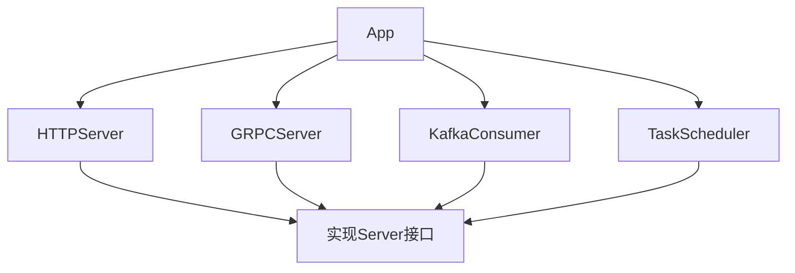
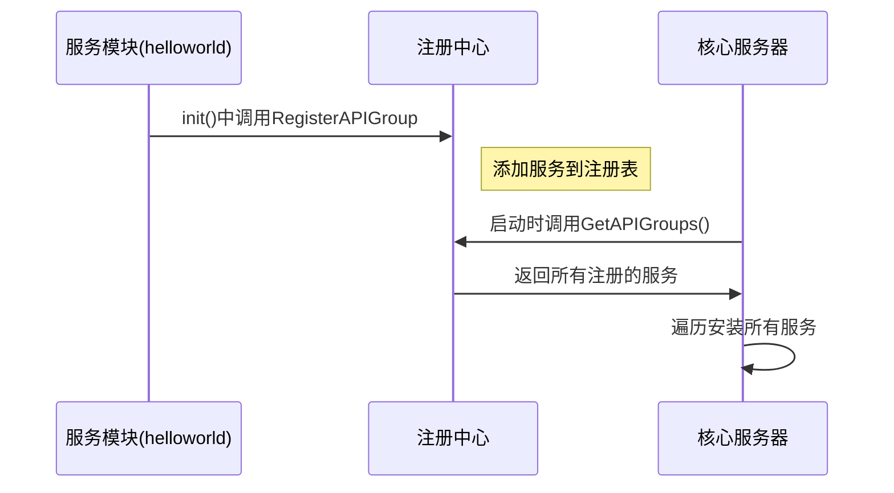
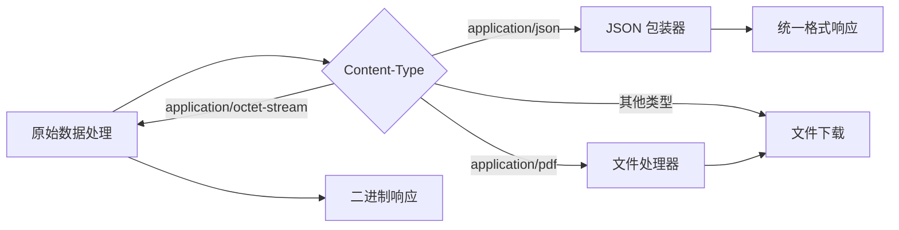

# 优化建议概览

| 痛点分析                                                                      | 优化建议                                  | 带来的好处                                                            |
| ----------------------------------------------------------------------------- | ----------------------------------------- | --------------------------------------------------------------------- |
| 应用核心耦合：app.App 与 gRPC/HTTP 服务强耦合，不易扩展其他类型的服务。       | 引入模块化 Server 接口                    | 框架可轻松集成和管理任何类型的服务（如消息队列消费者），扩展性极强。  |
| 服务注册僵化：每增加一个新服务，都需要手动修改 apiserver/server.go 进行注册。 | 引入依赖注入 (DI) 或服务注册机制          | 新增服务可实现"即插即用"，无需修改核心启动逻辑，降低模块间耦合。      |
| 中间件与配置强耦合：中间件直接依赖全局 Config 结构体，复用性差，测试困难。    | 中间件依赖具体参数而非全局配置            | 中间件与配置系统解耦，变得独立、可移植、易于单元测试。                |
| API 响应格式固定：response.Wrapper 统一了 JSON 响应，但格式硬编码，不够灵活。 | 使用 runtime.WithMarshalerOption 定制响应 | 可以根据不同 API 的需求，灵活定制成功或失败的响应结构，适应更多场景。 |

## 1. 应用核心层优化：模块化 Server 接口

问题分析
当前应用核心层直接管理 HTTP 和 gRPC 服务实例，导致：

- 新增服务类型需修改核心代码
- 服务生命周期管理耦合度高
- 扩展新服务（如消息队列消费者）困难

### 解决方案

1. 定义通用 Server 接口

```go
// pkg/app/server.go
package app

import "context"

type Server interface {
    Start(context.Context) error
    Stop(context.Context) error
}
```

2. 重构 App 结构

```go
// pkg/app/app.go
import (
    "context"
    "golang.org/x/sync/errgroup"
)

type App struct {
    servers []Server
    logger  *zap.Logger
}

func NewApp(logger *zap.Logger, servers ...Server) *App {
    return &App{
        servers: servers,
        logger:  logger,
    }
}

func (a *App) Start(ctx context.Context) error {
    g, ctx := errgroup.WithContext(ctx)

    for _, srv := range a.servers {
        srv := srv // 创建闭包变量副本
        g.Go(func() error {
            a.logger.Info("Starting server", zap.String("type", fmt.Sprintf("%T", srv)))
            return srv.Start(ctx)
        })
    }

    return g.Wait()
}

func (a *App) Stop(ctx context.Context) error {
    var errs []error

    for _, srv := range a.servers {
        if err := srv.Stop(ctx); err != nil {
            a.logger.Error("Failed to stop server",
                zap.Error(err),
                zap.String("type", fmt.Sprintf("%T", srv)))
            errs = append(errs, err)
        }
    }

    if len(errs) > 0 {
        return fmt.Errorf("multiple errors occurred during shutdown: %v", errs)
    }
    return nil
}
```

3. 服务实现示例

```go
// HTTPServer 实现
type HTTPServer struct {
    server *http.Server
}

func (s *HTTPServer) Start(ctx context.Context) error {
    go func() {
        if err := s.server.ListenAndServe(); err != nil && !errors.Is(err, http.ErrServerClosed) {
            log.Fatalf("HTTP server error: %v", err)
        }
    }()
    return nil
}

func (s *HTTPServer) Stop(ctx context.Context) error {
    return s.server.Shutdown(ctx)
}

// KafkaConsumer 实现示例
type KafkaConsumer struct {
    consumer *kafka.Consumer
}

func (c *KafkaConsumer) Start(ctx context.Context) error {
    go c.consumeMessages(ctx)
    return nil
}

func (c *KafkaConsumer) Stop(ctx context.Context) error {
    return c.consumer.Close()
}
```

4. 实现效果



### 优势

- 无缝扩展：新增服务类型只需实现 Server 接口
- 统一管理：所有服务生命周期统一管理
- 并发启动：利用 errgroup 实现并发启动和优雅停止
- 错误隔离：单个服务故障不影响其他服务启动

## 2.服务层优化：自动化服务注册

### 问题分析

- 新增服务需修改 apiserver/server.go
- 核心注册文件随服务增加日益臃肿
- 多人协作时容易产生代码冲突

### 解决方案

1. 创建服务注册中心

```go
// internal/apiserver/service_registry.go
package apiserver

import (
    "sync"
    "github.com/costa92/go-protoc/pkg/app"
)

var (
    apiGroups []app.APIGroupInstaller
    mutex     sync.Mutex
)

func RegisterAPIGroup(installer app.APIGroupInstaller) {
    mutex.Lock()
    defer mutex.Unlock()
    apiGroups = append(apiGroups, installer)
}

func GetAPIGroups() []app.APIGroupInstaller {
    mutex.Lock()
    defer mutex.Unlock()
    return append([]app.APIGroupInstaller{}, apiGroups...)
}
```

2. 服务自我注册

```go
// internal/helloworld/helloworld.go
package helloworld

import (
    "github.com/costa92/go-protoc/internal/apiserver"
    "github.com/costa92/go-protoc/pkg/app"
)

type HelloWorldInstaller struct{}

func NewInstaller() app.APIGroupInstaller {
    return &HelloWorldInstaller{}
}

func (i *HelloWorldInstaller) Install(group app.APIGroup) {
    // 注册路由逻辑
    group.GET("/hello", helloHandler)
}

func init() {
    apiserver.RegisterAPIGroup(NewInstaller())
}
```

3.动态加载服务

```go
// internal/apiserver/server.go
func setupAPIServer() *app.APIServer {
    apiServer := app.NewAPIServer()

    // 从注册表获取所有API组并安装
    for _, installer := range apiserver.GetAPIGroups() {
        apiServer.InstallAPIGroup(installer)
    }

    return apiServer
}
```

4. 注册流程



###优势

- 零修改核心：新增服务无需改动 server.go
- 自动发现：服务在初始化时自动注册
- 模块独立：每个服务模块管理自身注册逻辑
- 线程安全：使用互斥锁保证并发安全

## 3. 中间件优化：解耦配置依赖

### 问题分析

- 中间件直接依赖全局配置对象
- 配置变更导致中间件连锁修改
- 单元测试需构造完整配置结构

### 解决方案
1. 重构中间件参数
```go
// pkg/middleware/http/rate_limit.go
package httpmiddleware

import (
    "net/http"
    "golang.org/x/time/rate"
    "github.com/gorilla/mux"
)

// 参数从全局配置改为具体值
func RateLimitMiddleware(
    enabled bool, 
    rps rate.Limit, 
    burst int,
) mux.MiddlewareFunc {
    if !enabled {
        // 返回空中间件
        return func(next http.Handler) http.Handler {
            return next
        }
    }
    
    limiter := rate.NewLimiter(rps, burst)
    
    return func(next http.Handler) http.Handler {
        return http.HandlerFunc(func(w http.ResponseWriter, r *http.Request) {
            if !limiter.Allow() {
                http.Error(w, "too many requests", http.StatusTooManyRequests)
                return
            }
            next.ServeHTTP(w, r)
        })
    }
}
```
2. 配置注入示例

```go
// internal/apiserver/server.go
func applyMiddlewares(router *mux.Router, cfg *config.Config) {
    // 从配置解析具体参数
    rateLimitCfg := cfg.Middleware.RateLimit
    
    router.Use(
        httpmiddleware.RateLimitMiddleware(
            rateLimitCfg.Enabled,
            rate.Limit(rateLimitCfg.RPS),
            rateLimitCfg.Burst,
        ),
        httpmiddleware.CORSMiddleware(
            cfg.Middleware.CORS.AllowedOrigins,
            cfg.Middleware.CORS.AllowedMethods,
        ),
        // 其他中间件...
    )
}
```
3. 中间件测试示例

```go
func TestRateLimitMiddleware(t *testing.T) {
    // 不需要完整配置对象
    middleware := httpmiddleware.RateLimitMiddleware(true, 1, 1)
    
    req := httptest.NewRequest("GET", "/", nil)
    rr := httptest.NewRecorder()
    
    // 模拟处理函数
    handler := middleware(http.HandlerFunc(func(w http.ResponseWriter, r *http.Request) {
        w.WriteHeader(http.StatusOK)
    }))
    
    // 第一次请求应成功
    handler.ServeHTTP(rr, req)
    if rr.Code != http.StatusOK {
        t.Errorf("expected status 200, got %d", rr.Code)
    }
    
    // 第二次请求应被限流
    rr = httptest.NewRecorder()
    handler.ServeHTTP(rr, req)
    if rr.Code != http.StatusTooManyRequests {
        t.Errorf("expected status 429, got %d", rr.Code)
    }
}

```

### 优势

- 配置解耦：中间件不感知配置来源（文件/环境变量/数据库）
- 参数明确：构造函数声明所需参数，接口更清晰
- 测试简化：单元测试无需模拟完整配置对象
- 复用性高：中间件可跨项目直接使用

## 4.响应层优化：灵活响应格式

### 问题分析

- 所有响应强制包装为固定JSON结构
- 无法支持文件下载、流式响应等场景
- 特殊API需求难以实现

### 解决方案

1. 创建多响应格式处理器

```go
// pkg/response/marshalers.go

// 默认JSON包装器
type JSONMarshaler struct{}

func (m *JSONMarshaler) Marshal(v interface{}) ([]byte, error) {
    // 统一包装逻辑
    resp := Wrapper{
        Code:    0,
        Message: "success",
        Data:    v,
    }
    return json.Marshal(resp)
}

// 原始数据处理器（无包装）
type RawDataMarshaler struct{}

func (m *RawDataMarshaler) Marshal(v interface{}) ([]byte, error) {
    if data, ok := v.([]byte); ok {
        return data, nil
    }
    return json.Marshal(v) // 无包装JSON
}

// 文件下载处理器
type FileMarshaler struct{}

func (m *FileMarshaler) Marshal(v interface{}) ([]byte, error) {
    if f, ok := v.(*os.File); ok {
        return io.ReadAll(f)
    }
    return nil, errors.New("unsupported file type")
}
```

2. 动态注册响应处理器

```go
// internal/apiserver/setup_gateway.go
func setupGRPCGateway(ctx context.Context) (http.Handler, error) {
    // 创建基础Mux
    gwmux := runtime.NewServeMux(
        runtime.WithMarshalerOption(
            "application/json", 
            &response.JSONMarshaler{},
        ),
        runtime.WithMarshalerOption(
            "application/octet-stream", 
            &response.RawDataMarshaler{},
        ),
        runtime.WithMarshalerOption(
            "application/pdf",
            &response.FileMarshaler{},
        ),
        runtime.WithErrorHandler(response.CustomHTTPErrorHandler),
    )
    
    // 注册gRPC端点...
    return gwmux, nil
}
```

3. 特殊响应端点示例

```go
// 文件下载端点
func downloadHandler(w http.ResponseWriter, r *http.Request) {
    file, err := os.Open("report.pdf")
    if err != nil {
        http.Error(w, "file not found", http.StatusNotFound)
        return
    }
    defer file.Close()
    
    // 设置Content-Type触发FileMarshaler
    w.Header().Set("Content-Type", "application/pdf")
    w.Header().Set("Content-Disposition", "attachment; filename=report.pdf")
    
    // 直接返回文件对象
    response.Success(w, file)
}

// 原始数据端点
func rawDataHandler(w http.ResponseWriter, r *http.Request) {
    // 设置Content-Type触发RawDataMarshaler
    w.Header().Set("Content-Type", "application/octet-stream")
    
    // 返回原始字节数据（无包装）
    data := []byte{0x48, 0x65, 0x6C, 0x6C, 0x6F} // "Hello"的二进制
    response.Success(w, data)
}
```

4. 响应处理流程




### 优势

- 格式自由：支持 JSON/二进制/文件等多样响应
- 按需定制：不同端点可使用不同响应格式
- 平滑迁移：默认保持现有JSON格式，特殊API按需覆盖
- 内容协商：基于标准 Content-Type 分发处理器