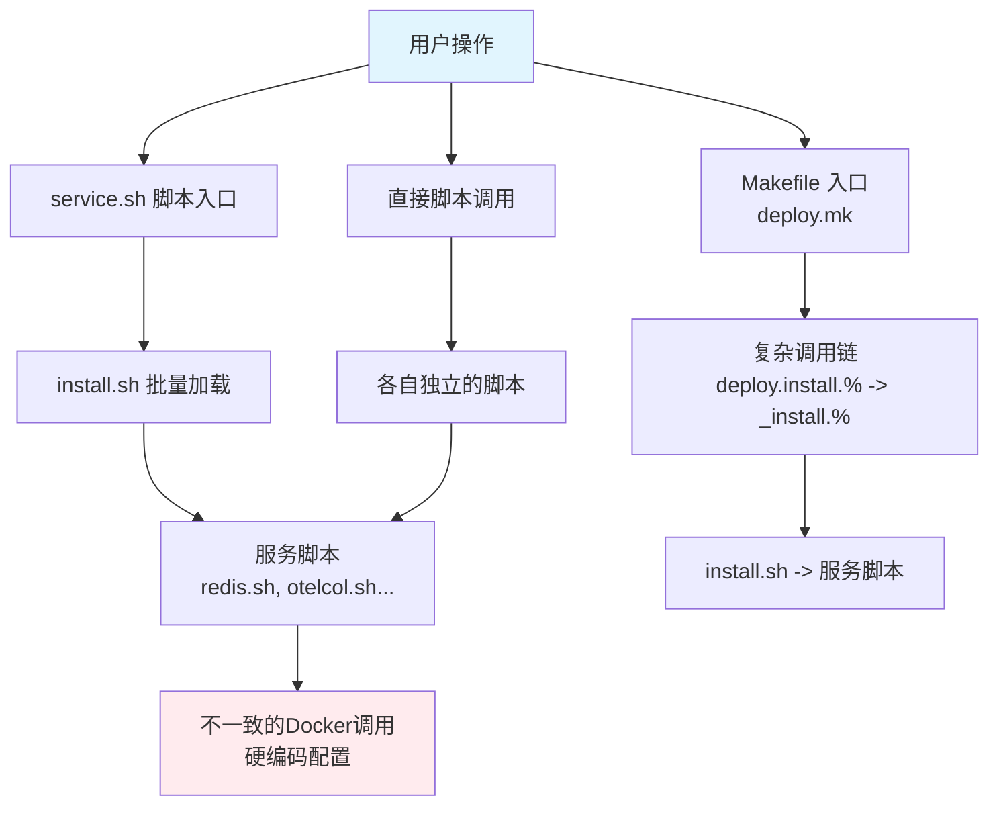
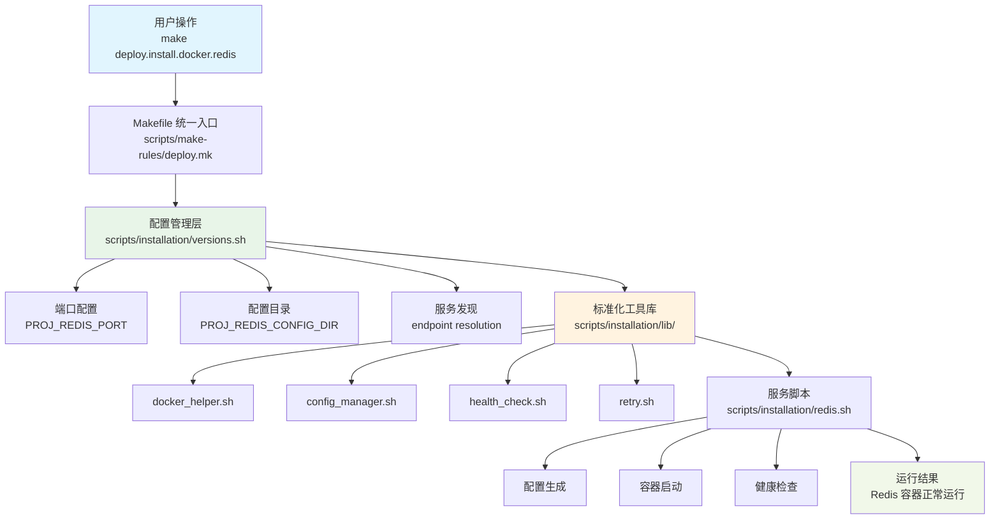
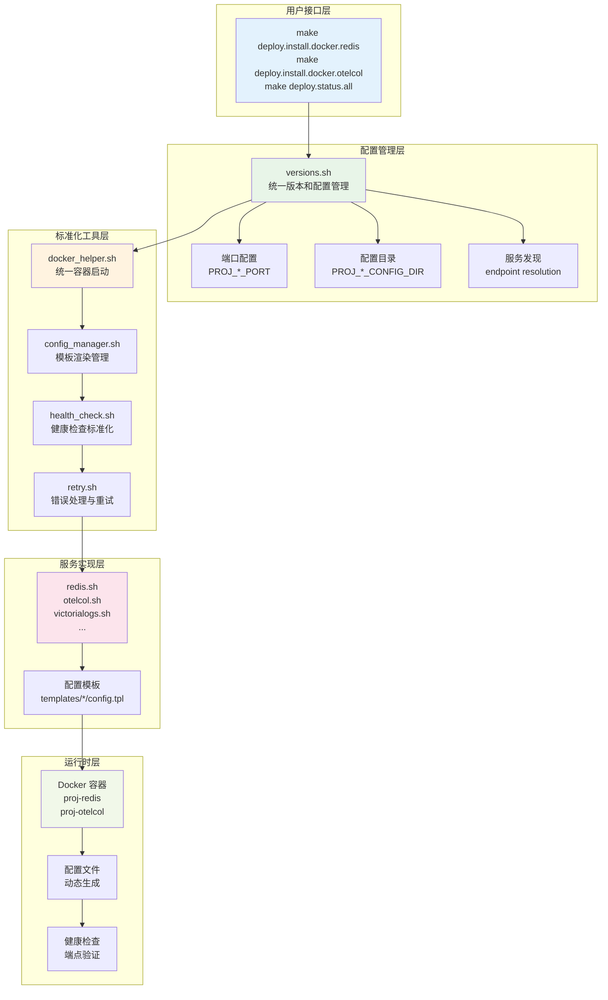
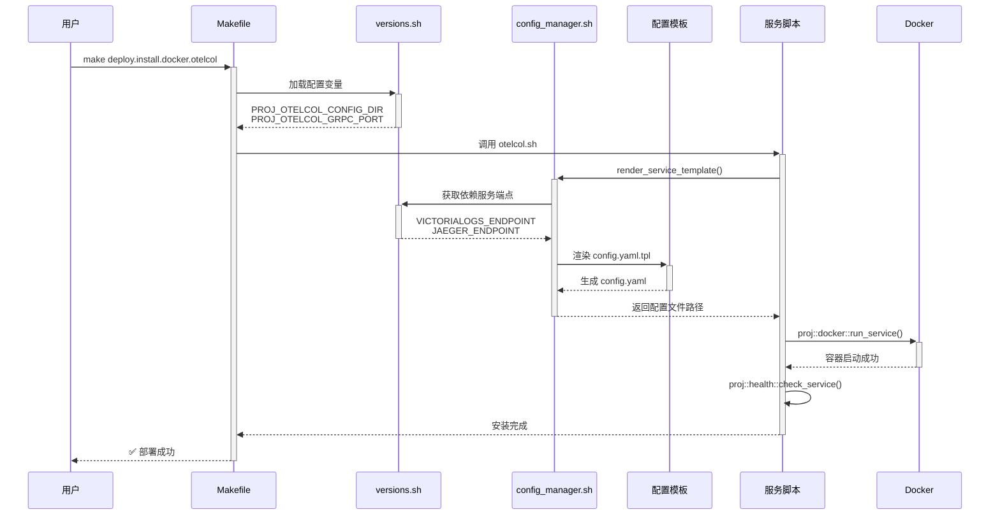
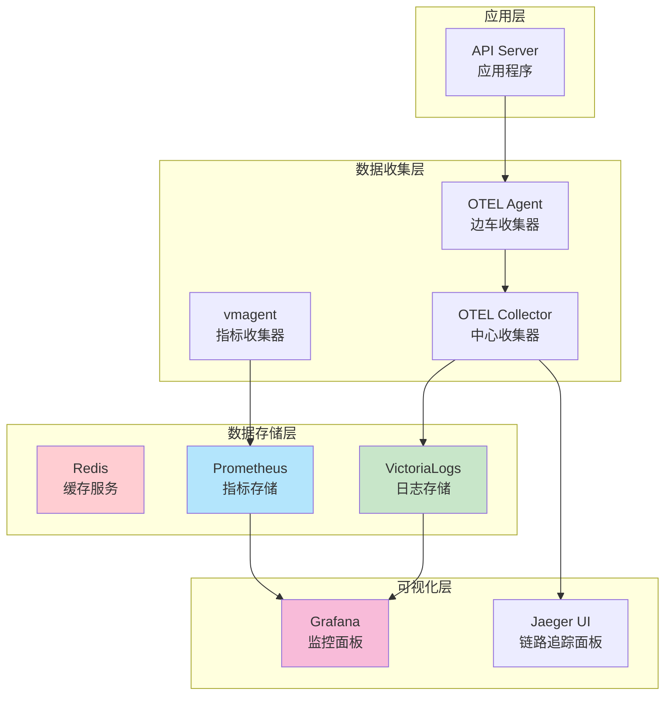
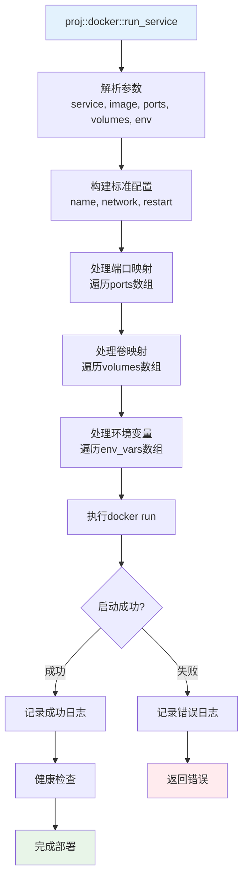
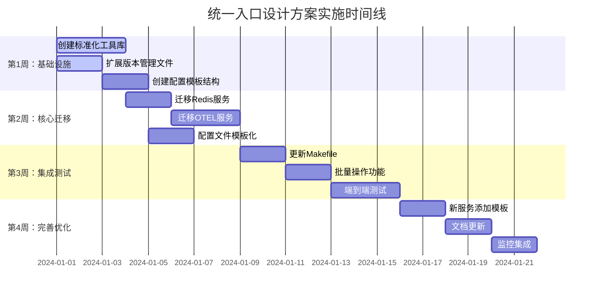

# Makefile 统一入口设计方案

## 📄 概述与目标

### 项目背景

当前项目的服务部署管理存在多个入口和不一致的调用方式，导致维护复杂性和用户困惑。本设计方案旨在通过统一入口、标准化配置和流程优化，建立清晰、可维护的服务管理体系。

### 核心目标

- **统一用户入口**: Makefile 作为唯一的用户操作入口
- **标准化流程**: Docker 容器启动、配置管理、错误处理标准化
- **配置集中管理**: 端口、地址、依赖关系统一配置和管理
- **简化服务添加**: 新服务添加时间从2小时减少到30分钟

### 预期收益概述

| 指标类型 | 当前状态 | 目标状态 | 改善程度 |
|---------|---------|---------|----------|
| **入口数量** | 3个不同入口 | 1个统一入口 | 简化67% |
| **新服务添加** | 2小时 | 30分钟 | 效率提升75% |
| **配置错误率** | 经常出现 | 减少80% | 大幅改善 |
| **代码重复度** | 高 | 减少60% | 显著改善 |

## 🔍 现状分析

### 当前系统架构



### 存在的具体问题

#### 1. 入口系统冗余
- **scripts/installation/service.sh** - 脚本统一入口
- **scripts/make-rules/deploy.mk** - Makefile 统一入口  
- **scripts/installation/install.sh** - 批量脚本加载器

#### 2. 调用方式不一致
```bash
# 三种不同的调用方式
./scripts/installation/service.sh start redis
make deploy.install.docker.redis  
./scripts/installation/redis.sh proj::redis::docker::install
```

#### 3. Docker命令分散且不统一
```bash
# redis.sh 中的 Docker 调用
docker run -d --name proj-redis --network proj -p 6379:6379 redis:7.2.4

# otelcol.sh 中的复杂 Docker 调用  
docker run -d --name proj-otelcol \
  --network proj \
  -v config.yaml:/etc/config.yaml:ro \
  -v logs:/host/logs:ro \
  -p 4327:4327 -p 4328:4328 \
  otel/opentelemetry-collector-contrib:0.132.0
```

#### 4. 配置文件管理分散
- 端口号在各个脚本中硬编码
- 配置文件路径不统一
- 服务间依赖关系不清晰

### 问题影响评估

| 问题类别 | 影响程度 | 具体表现 |
|---------|---------|---------|
| **维护成本** | 🔴 高 | 需要同时维护三套不同逻辑 |
| **用户体验** | 🟡 中 | 用户需要学习多种使用方式 |
| **系统可靠性** | 🔴 高 | 错误处理不一致，故障定位困难 |
| **扩展性** | 🔴 高 | 添加新服务需要修改多个文件 |

## 🎯 解决方案总览

### 设计原则

1. **单一入口原则** (Single Source of Truth)
   - Makefile 作为唯一用户入口
   - 所有服务管理操作通过 make 命令执行

2. **标准化原则** (Standardization)
   - 统一的 Docker 容器启动函数
   - 标准化的配置文件管理
   - 一致的错误处理和健康检查

3. **配置集中原则** (Centralized Configuration)
   - 端口、地址在 versions.sh 中统一管理
   - 服务间依赖关系清晰定义
   - 配置模板化，支持环境变量

4. **向后兼容原则** (Backward Compatibility)
   - 保持现有 make 命令不变
   - 渐进式迁移，不影响现有功能

### 总体架构愿景



### 核心设计决策

#### 1. 技术栈选择
- **保持 Shell 脚本**: 适合一次性服务安装场景，学习成本低
- **Mermaid 流程图**: 提供清晰的架构可视化
- **模板系统**: 使用 envsubst 进行配置文件动态生成

#### 2. 架构分层
- **用户接口层**: Makefile 提供统一命令接口
- **配置管理层**: 统一的变量和服务发现机制
- **工具函数层**: 标准化的工具函数库
- **服务实现层**: 各服务的具体安装逻辑

#### 3. 兼容性策略
- 保持现有 make 命令接口不变
- 通过功能增强而非重写实现改进
- 分阶段迁移，降低风险

## 🏗️ 架构设计

### 整体架构图



### 配置管理流程图



### 服务依赖关系图



## 🛠️ 技术方案详述

### Docker容器标准化

#### 统一Docker启动函数

```bash
# scripts/installation/lib/docker_helper.sh
proj::docker::run_service() {
    local service_name="$1"
    local image="$2"
    local -n ports_ref=$3
    local -n volumes_ref=$4  
    local -n env_vars_ref=$5
    
    local container_name="${NETWORK_NAME}-${service_name}"
    local docker_args=(
        "--name" "$container_name"
        "--network" "$NETWORK_NAME"
        "--restart" "unless-stopped"
        "--detach"
    )
    
    # 动态构建 Docker 参数
    for port_mapping in "${ports_ref[@]}"; do
        docker_args+=("-p" "$port_mapping")
    done
    
    for volume_mapping in "${volumes_ref[@]}"; do
        docker_args+=("-v" "$volume_mapping")
    done
    
    for env_var in "${env_vars_ref[@]}"; do
        docker_args+=("-e" "$env_var")
    done
    
    # 统一的容器启动和错误处理
    if docker run "${docker_args[@]}" "$image"; then
        proj::log::success "Container $container_name started successfully"
        return 0
    else
        proj::log::error "Failed to start container $container_name"
        return 1
    fi
}
```

#### Docker启动流程图



### 配置文件管理标准化

#### 统一配置目录变量

```bash
# scripts/installation/versions.sh 扩展
# 数据库服务配置目录
export PROJ_REDIS_CONFIG_DIR=${PROJ_REDIS_CONFIG_DIR:-"${PROJ_ROOT_DIR}/_data/redis/config"}
export PROJ_MYSQL_CONFIG_DIR=${PROJ_MYSQL_CONFIG_DIR:-"${PROJ_ROOT_DIR}/_data/mysql/config"}

# 可观测性服务配置目录
export PROJ_OTEL_AGENT_CONFIG_DIR=${PROJ_OTEL_AGENT_CONFIG_DIR:-"${PROJ_ROOT_DIR}/_data/otel-agent/config"}
export PROJ_OTELCOL_CONFIG_DIR=${PROJ_OTELCOL_CONFIG_DIR:-"${PROJ_ROOT_DIR}/_data/otelcol/config"}
export PROJ_JAEGER_CONFIG_DIR=${PROJ_JAEGER_CONFIG_DIR:-"${PROJ_ROOT_DIR}/_data/jaeger/config"}

# 服务端口配置
export PROJ_REDIS_PORT=${PROJ_REDIS_PORT:-6379}
export PROJ_OTELCOL_GRPC_PORT=${PROJ_OTELCOL_GRPC_PORT:-4327}
export PROJ_VICTORIALOGS_PORT=${PROJ_VICTORIALOGS_PORT:-9428}
```

#### 配置模板管理函数

```bash
# scripts/installation/lib/config_manager.sh
proj::config::render_service_template() {
    local service_name="$1"
    local template_name="${2:-config-docker.yaml}"
    
    # 获取服务配置目录
    local config_dir_var="PROJ_${service_name^^}_CONFIG_DIR"
    local config_dir="${!config_dir_var}"
    
    mkdir -p "$config_dir"
    
    local template_file="${SCRIPT_DIR}/templates/${service_name}/${template_name}.tpl"
    local output_file="${config_dir}/${template_name}"
    
    # 注入服务发现变量
    proj::config::inject_service_vars "$service_name"
    
    # 渲染模板
    envsubst < "$template_file" > "$output_file"
    echo "$output_file"
}
```

#### 目录结构标准化

```
scripts/installation/
├── templates/                    # 按服务组织的配置模板
│   ├── otel-agent/
│   │   └── config-docker.yaml.tpl
│   ├── otelcol/
│   │   └── config-docker.yaml.tpl
│   └── prometheus/
│       └── prometheus.yml.tpl
├── lib/                         # 标准化工具库
│   ├── docker_helper.sh
│   ├── config_manager.sh
│   ├── health_check.sh
│   └── retry.sh
└── versions.sh                  # 统一配置管理
```

### Shell脚本最佳实践

#### 标准化服务脚本模板

```bash
#!/usr/bin/env bash
# scripts/installation/template-service.sh

set -eEuo pipefail
SCRIPT_DIR="$(cd "$(dirname "${BASH_SOURCE[0]}")" && pwd)"
source "${SCRIPT_DIR}/common.sh"

# 服务特定配置
SERVICE_NAME="template"
SERVICE_PORTS=(8080)
SERVICE_DEPENDENCIES=("redis")

# 标准函数接口
proj::${SERVICE_NAME}::docker::install() {
    # 1. 前置检查
    proj::service::validate_dependencies "${SERVICE_DEPENDENCIES[@]}"
    
    # 2. 配置生成
    local config_file
    config_file=$(proj::config::render_service_template "$SERVICE_NAME")
    
    # 3. 容器配置
    local image="${SERVICE_NAME}:${SERVICE_VERSION}"
    local ports=("${SERVICE_PORTS[@]/#/${PROJ_${SERVICE_NAME^^}_PORT}:}")
    local volumes=("${config_file}:/etc/config.yaml:ro")
    local env_vars=("SERVICE_NAME=${SERVICE_NAME}")
    
    # 4. 启动容器
    proj::docker::run_service "$SERVICE_NAME" "$image" ports volumes env_vars
    
    # 5. 健康检查
    proj::health::check_service "$SERVICE_NAME"
}

# 参数路由
main() {
    case "${1:-}" in
        "docker.install") proj::${SERVICE_NAME}::docker::install ;;
        "docker.uninstall") proj::${SERVICE_NAME}::docker::uninstall ;;
        "status") proj::${SERVICE_NAME}::status ;;
        *) echo "Usage: $0 {docker.install|docker.uninstall|status}"; exit 1 ;;
    esac
}

[[ "${BASH_SOURCE[0]}" == "${0}" ]] && main "$@"
```

#### 错误处理和重试机制

```bash
# scripts/installation/lib/retry.sh
proj::retry::with_backoff() {
    local max_attempts=$1
    local delay=$2
    local command="${@:3}"
    local attempt=1
    
    while [ $attempt -le $max_attempts ]; do
        if eval "$command"; then
            return 0
        fi
        
        proj::log::warn "Attempt $attempt failed, retrying in ${delay}s..."
        sleep $delay
        delay=$((delay * 2))  # 指数退避
        attempt=$((attempt + 1))
    done
    
    proj::log::error "Command failed after $max_attempts attempts"
    return 1
}
```

#### 健康检查标准化

```bash
# scripts/installation/lib/health_check.sh
proj::health::check_service() {
    local service_name="$1"
    local timeout=${2:-30}
    
    case "$service_name" in
        "redis")
            proj::health::check_redis_ping
            ;;
        "victorialogs")
            proj::health::check_http "127.0.0.1:9428/health" "$timeout"
            ;;
        "otel-agent"|"otelcol")
            proj::health::check_http "127.0.0.1:13133" "$timeout"
            ;;
        *)
            proj::log::warn "No specific health check for $service_name"
            proj::health::check_container "$service_name"
            ;;
    esac
}

proj::health::check_http() {
    local endpoint="$1"
    local timeout=${2:-30}
    
    if proj::retry::with_backoff 5 2 "curl -f -s -m 5 http://$endpoint >/dev/null"; then
        proj::log::success "Health check passed: $endpoint"
        return 0
    else
        proj::log::error "Health check failed: $endpoint"
        return 1
    fi
}
```

## 📅 实施计划

### 实施时间线



### 任务优先级矩阵

| 任务类别 | 紧急度 | 重要度 | 预计工期 | 责任人 |
|---------|--------|--------|----------|--------|
| **Docker标准化** | 🔴 高 | 🔴 高 | 3天 | 开发团队 |
| **配置目录变量** | 🔴 高 | 🔴 高 | 2天 | 开发团队 |
| **模板系统** | 🟡 中 | 🔴 高 | 4天 | 开发团队 |
| **健康检查机制** | 🟡 中 | 🟡 中 | 3天 | 开发团队 |
| **批量操作功能** | 🟢 低 | 🟡 中 | 2天 | 开发团队 |
| **监控集成** | 🟢 低 | 🟢 低 | 2天 | 可选 |

### 风险控制措施

#### 1. 兼容性风险
- **风险**: 新方案可能影响现有功能
- **控制措施**: 
  - 保持所有现有 make 命令不变
  - 分阶段迁移，每阶段完整测试
  - 准备回滚方案

#### 2. 学习成本风险  
- **风险**: 团队需要学习新的标准化函数
- **控制措施**:
  - 提供详细的函数文档和示例
  - 创建标准化的服务模板
  - 进行团队培训

#### 3. 迁移复杂度风险
- **风险**: 现有服务脚本迁移工作量大
- **控制措施**:
  - 优先迁移核心服务验证方案
  - 制定明确的迁移检查清单
  - 自动化验证工具

## 📊 成功指标与收益

### 技术指标

- ✅ **统一化程度**: 100%的服务使用标准化Docker启动函数
- ✅ **配置自动化**: 100%的配置文件通过模板自动生成
- ✅ **错误处理**: 统一的重试机制和健康检查覆盖所有服务
- ✅ **代码复用**: 代码重复度减少60%以上

### 用户体验指标

- ✅ **命令一致性**: 100%保持现有make命令接口
- ✅ **错误诊断**: 提供清晰的错误信息和建议解决方案
- ✅ **配置灵活性**: 支持环境变量自定义所有配置项

### 维护成本指标

- ✅ **新服务添加效率**: 从2小时减少到30分钟（提升75%）
- ✅ **配置错误减少**: 配置相关错误减少80%
- ✅ **文档维护**: 统一的文档结构和自动生成机制

### 系统可靠性指标

- ✅ **健康检查覆盖**: 100%的服务支持自动健康检查
- ✅ **故障恢复**: 自动重试机制减少人工干预
- ✅ **依赖管理**: 清晰的服务依赖关系和自动验证

---

## 📋 实施检查清单

### 第1周任务清单
- [ ] 创建 `scripts/installation/lib/docker_helper.sh`
- [ ] 创建 `scripts/installation/lib/config_manager.sh`
- [ ] 创建 `scripts/installation/lib/health_check.sh`  
- [ ] 创建 `scripts/installation/lib/retry.sh`
- [ ] 扩展 `scripts/installation/versions.sh` 添加配置目录变量
- [ ] 创建 `scripts/installation/templates/` 目录结构

### 第2周任务清单
- [ ] 迁移 `redis.sh` 使用标准化函数
- [ ] 迁移 `otelcol.sh` 使用配置模板
- [ ] 迁移 `victorialogs.sh` 使用健康检查
- [ ] 转换核心配置文件为模板格式

### 第3周任务清单
- [ ] 更新 `scripts/make-rules/deploy.mk` 集成配置管理
- [ ] 添加批量操作支持 (`deploy.database.docker.install`)
- [ ] 进行完整的端到端测试
- [ ] 验证所有现有命令正常工作

### 第4周任务清单
- [ ] 创建 `scripts/installation/template-service.sh` 模板
- [ ] 更新项目文档 (CLAUDE.md)
- [ ] 添加新服务添加指南
- [ ] 可选: 集成部署监控功能

通过这个重新整理的设计方案，我们将建立一个清晰、可维护、标准化的服务部署管理体系，为项目的长期发展奠定坚实基础。