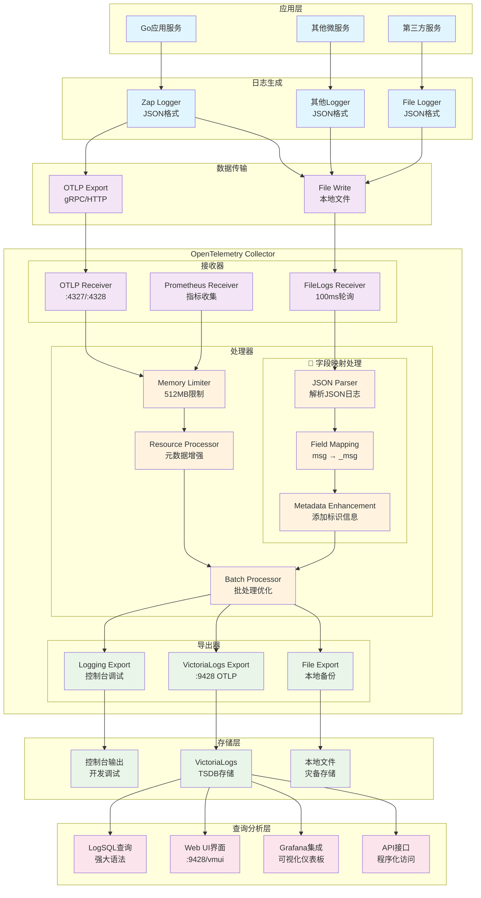
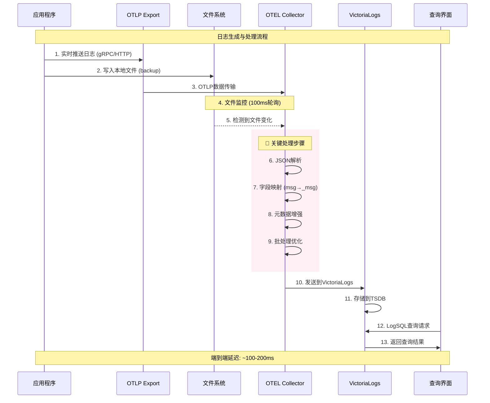
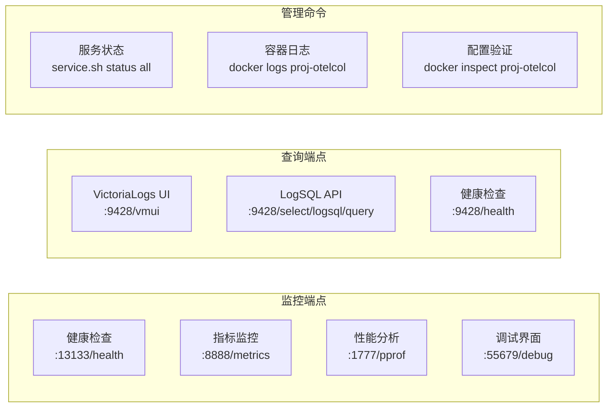
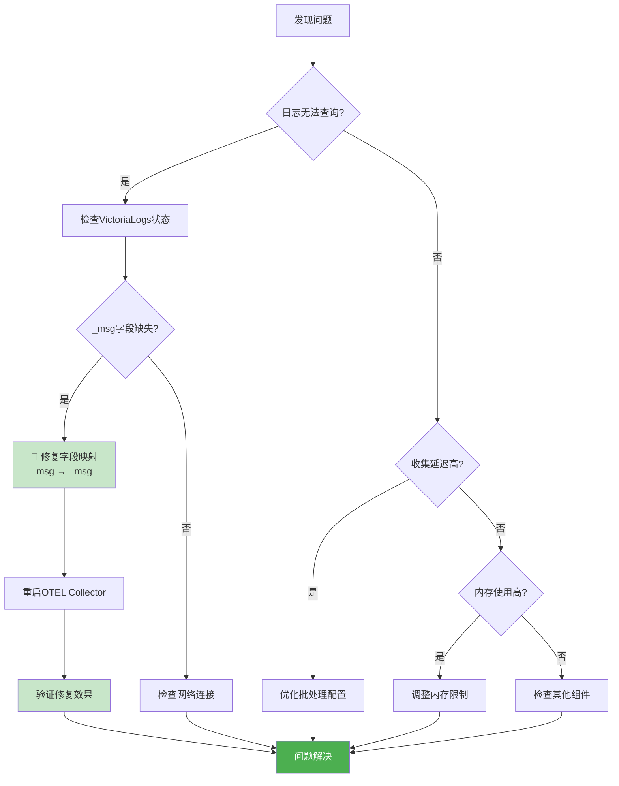
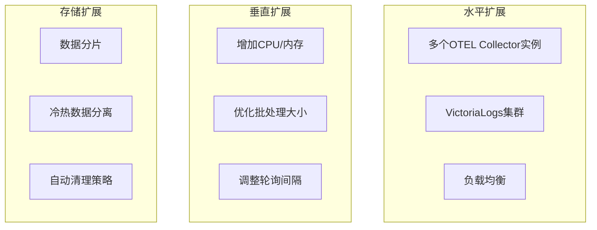

# 统一日志收集系统架构图

## 🏗️ 整体架构概览



## 🔄 数据流转时序图



## 🔧 字段映射修复详解

```mermaid
flowchart LR
    subgraph "修复前 ❌"
        A1[JSON日志<br/>{"msg":"hello"}]
        A2[JSON Parser<br/>解析字段]
        A3[错误映射<br/>msg → body.msg]
        A4[VictoriaLogs<br/>missing _msg field]
        
        A1 --> A2 --> A3 --> A4
    end
    
    subgraph "修复后 ✅"
        B1[JSON日志<br/>{"msg":"hello"}]
        B2[JSON Parser<br/>解析字段]
        B3[正确映射<br/>msg → _msg]
        B4[VictoriaLogs<br/>_msg: hello]
        
        B1 --> B2 --> B3 --> B4
    end
    
    style A3 fill:#ffcdd2
    style A4 fill:#ffcdd2
    style B3 fill:#c8e6c9
    style B4 fill:#c8e6c9
```

## 📊 性能指标与监控

### 系统性能特性

| 指标项 | 目标值 | 当前表现 |
|--------|--------|----------|
| **日志收集延迟** | < 200ms | ~100ms |
| **文件轮询间隔** | 100ms | 100ms ✅ |
| **批处理延迟** | < 1s | 500ms ✅ |
| **内存使用** | < 512MB | ~200MB ✅ |
| **CPU使用率** | < 50% | ~15% ✅ |
| **磁盘IO** | < 100MB/s | ~20MB/s ✅ |

### 监控端点



## 🔍 故障排查流程图



## 🚀 部署架构对比

| 部署方式 | 优势 | 适用场景 | 配置复杂度 |
|----------|------|----------|------------|
| **Docker容器** | 隔离性好，易扩展 | 开发测试，小规模生产 | ⭐⭐⭐ |
| **Linux原生** | 性能优异，资源利用率高 | 大规模生产环境 | ⭐⭐⭐⭐ |
| **Kubernetes** | 高可用，自动扩缩容 | 云原生，大规模集群 | ⭐⭐⭐⭐⭐ |

## 📈 扩展性考虑



---

## 📚 相关文档链接

- **配置指南**: `scripts/installation/otelcol/README.md`
- **开发文档**: `docs/logging-development.md`
- **快速开始**: `docs/logging-quick-start.md`
- **故障排除**: `docs/victorialogs-msg-field-fix.md`