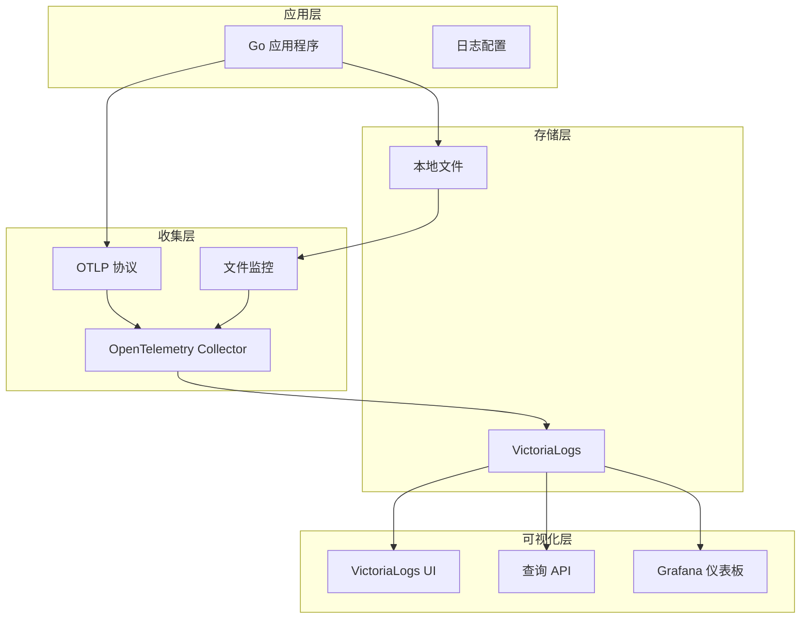

# 统一日志收集架构设计文档

## 概览

本项目实现了一套完整的统一日志收集、处理和分析系统，支持多种部署环境（本地开发、Docker、Kubernetes），具备实时监控、结构化存储和强大的查询分析能力。

## 🏗️ 架构设计

### 核心组件



### 数据流转

1. **应用程序** → 生成结构化日志（JSON 格式）
2. **多路输出** → 同时写入文件和发送到 OTLP 端点
3. **OTEL Collector** → 统一收集、处理和路由日志
4. **VictoriaLogs** → 高性能日志存储和索引
5. **查询接口** → 支持 UI、API 和 Grafana 查询

## 📋 功能特性

### ✅ 已实现功能

- **双路收集**：OTLP 协议 + 文件监控
- **结构化日志**：JSON 格式自动解析
- **实时监控**：毫秒级日志收集延迟
- **多环境支持**：本地开发、Docker、容器化
- **统一配置**：通过配置文件管理所有参数
- **错误追踪**：完整的堆栈跟踪和错误上下文
- **元数据丰富**：服务名、版本、环境等标签
- **高可用性**：容错机制和重试策略

### 🚀 核心优势

- **零侵入**：不影响应用程序性能
- **高性能**：批量处理和异步发送
- **可观测性**：完整的监控和追踪
- **易扩展**：支持多种输出目标
- **统一管理**：集中化配置和监控

## 🔧 技术栈

| 组件 | 技术 | 版本 | 用途 |
|------|------|------|------|
| **日志框架** | Zap | Latest | 高性能结构化日志 |
| **收集器** | OpenTelemetry Collector | v0.91.0 | 统一日志收集和处理 |
| **存储引擎** | VictoriaLogs | v1.28.0 | 高性能日志存储 |
| **协议** | OTLP | v1.0 | 开放遥测协议 |
| **容器编排** | Docker Compose | Latest | 本地开发环境 |
| **服务网格** | Kubernetes | Latest | 生产环境部署 |

## 📁 项目结构

```sh
项目根目录/
├── configs/
│   └── apiserver.yaml                    # 主配置文件
├── scripts/installation/
│   ├── otelcol/                         # OTEL Collector 配置
│   │   ├── config-docker-files.yaml     # Docker 文件监控配置
│   │   ├── config-k8s.yaml             # Kubernetes 配置
│   │   └── config-local.yaml           # 本地开发配置
│   ├── otelcol.sh                       # OTEL Collector 安装脚本
│   ├── victoria.sh                      # VictoriaLogs 管理脚本
│   └── service.sh                       # 统一服务管理
├── deployments/
│   ├── docker-compose/                  # Docker Compose 部署
│   │   └── logging-stack.yml
│   └── kubernetes/                      # Kubernetes 部署
│       ├── otelcol/
│       ├── victorialogs/
│       └── monitoring/
├── docs/
│   ├── logging-architecture.md          # 本文档
│   ├── logging-development.md           # 开发使用文档
│   └── logging-operations.md            # 运维指南
└── logs/                                # 本地日志目录
    └── apiserver/
        └── app.log
```

## ⚙️ 配置管理

### 应用配置 (configs/apiserver.yaml)

```yaml
# 日志系统配置
log:
  type: "zap"                            # 日志框架类型
  level: "debug"                         # 日志级别
  format: "json"                         # 输出格式
  output-paths: ["stdout", "logs/apiserver/app.log"]

  # OpenTelemetry 日志集成
  otlp:
    enabled: true                        # 启用 OTLP 日志
    endpoint: "127.0.0.1:4327"          # OTEL Collector 端点
    insecure: true                       # 非安全连接（开发环境）
    batch_size: 100                      # 批量发送大小
    export_timeout: 30s                  # 导出超时
    resource_attributes:
      service.name: "apiserver"
      service.version: "v2.0.0"
      service.namespace: "go-protoc"
      deployment.environment: "development"

  # 初始字段（所有日志条目包含）
  initial-fields:
    service: "apiserver"
    version: "v2.0.0"
    environment: "development"
```

### OTEL Collector 配置

#### 本地开发环境 (config-local.yaml)

```yaml
receivers:
  otlp:
    protocols:
      grpc:
        endpoint: 0.0.0.0:4327
      http:
        endpoint: 0.0.0.0:4328

processors:
  batch:
    timeout: 1s
    send_batch_size: 1024
  memory_limiter:
    limit_mib: 512

exporters:
  loki/victorialogs:
    endpoint: http://127.0.0.1:9428/insert/loki/api/v1/push
  logging:
    verbosity: detailed

service:
  pipelines:
    logs:
      receivers: [otlp]
      processors: [memory_limiter, batch]
      exporters: [logging, loki/victorialogs]
```

#### Docker 环境 (config-docker-files.yaml)

```yaml
receivers:
  otlp:
    protocols:
      grpc:
        endpoint: 0.0.0.0:4327
      http:
        endpoint: 0.0.0.0:4328

  # 文件日志监控
  filelog:
    include:
      - /host/logs/**/*.log
      - /host/logs/**/*.json
    exclude:
      - /host/logs/otelcol-*
    operators:
      - type: json_parser
        if: 'body matches "^\\{.*\\}$"'
        parse_from: body
        parse_to: attributes
      - type: add
        field: attributes.log_source
        value: "file"

processors:
  batch:
    timeout: 1s
    send_batch_size: 1024
  memory_limiter:
    limit_mib: 512
  resource:
    attributes:
      - key: service.name
        value: "${PROJ_SERVICE_NAME}"
        action: upsert

exporters:
  loki/victorialogs:
    endpoint: http://proj-victorialogs:9428/insert/loki/api/v1/push

service:
  pipelines:
    logs:
      receivers: [otlp, filelog]
      processors: [memory_limiter, resource, batch]
      exporters: [logging, loki/victorialogs]
```

## 🐳 Docker 环境部署

### Docker Compose 配置

```yaml
# deployments/docker-compose/logging-stack.yml
version: '3.8'

networks:
  proj:
    driver: bridge

services:
  # VictoriaLogs - 日志存储
  victorialogs:
    image: victoriametrics/victoria-logs:v1.28.0
    container_name: proj-victorialogs
    ports:
      - "9428:9428"
    volumes:
      - victorialogs_data:/victorialogs-data
    command:
      - -storageDataPath=/victorialogs-data
      - -httpListenAddr=:9428
    networks:
      - proj
    restart: unless-stopped

  # OpenTelemetry Collector
  otelcol:
    image: otel/opentelemetry-collector-contrib:0.91.0
    container_name: proj-otelcol
    ports:
      - "4327:4327"  # OTLP gRPC
      - "4328:4328"  # OTLP HTTP
      - "8888:8888"  # Metrics
      - "13133:13133" # Health check
    volumes:
      - ./otelcol/config-docker-files.yaml:/etc/otelcol-contrib/config.yaml
      - /path/to/project/logs:/host/logs:ro  # 日志文件监控
    environment:
      - PROJ_SERVICE_NAME=apiserver
      - PROJ_SERVICE_VERSION=v2.0.0
      - PROJ_ENVIRONMENT=development
    depends_on:
      - victorialogs
    networks:
      - proj
    restart: unless-stopped

  # Grafana - 可视化（可选）
  grafana:
    image: grafana/grafana:latest
    container_name: proj-grafana
    ports:
      - "3000:3000"
    volumes:
      - grafana_data:/var/lib/grafana
      - ./grafana/provisioning:/etc/grafana/provisioning
    environment:
      - GF_SECURITY_ADMIN_PASSWORD=admin
    networks:
      - proj
    restart: unless-stopped

volumes:
  victorialogs_data:
  grafana_data:
```

### 快速启动命令

```bash
# 启动完整日志栈
./scripts/installation/service.sh start all

# 或使用 Docker Compose
docker-compose -f deployments/docker-compose/logging-stack.yml up -d

# 检查服务状态
./scripts/installation/service.sh status all
```

## ☸️ Kubernetes 环境部署

### Namespace 配置

```yaml
# deployments/kubernetes/namespace.yaml
apiVersion: v1
kind: Namespace
metadata:
  name: logging
  labels:
    name: logging
```

### VictoriaLogs 部署

```yaml
# deployments/kubernetes/victorialogs/deployment.yaml
apiVersion: apps/v1
kind: Deployment
metadata:
  name: victorialogs
  namespace: logging
spec:
  replicas: 1
  selector:
    matchLabels:
      app: victorialogs
  template:
    metadata:
      labels:
        app: victorialogs
    spec:
      containers:
      - name: victorialogs
        image: victoriametrics/victoria-logs:v1.28.0
        ports:
        - containerPort: 9428
        args:
        - -storageDataPath=/victorialogs-data
        - -httpListenAddr=:9428
        volumeMounts:
        - name: data
          mountPath: /victorialogs-data
        resources:
          requests:
            memory: "512Mi"
            cpu: "200m"
          limits:
            memory: "2Gi"
            cpu: "1000m"
      volumes:
      - name: data
        persistentVolumeClaim:
          claimName: victorialogs-pvc

---
apiVersion: v1
kind: Service
metadata:
  name: victorialogs
  namespace: logging
spec:
  selector:
    app: victorialogs
  ports:
  - port: 9428
    targetPort: 9428
  type: ClusterIP

---
apiVersion: v1
kind: PersistentVolumeClaim
metadata:
  name: victorialogs-pvc
  namespace: logging
spec:
  accessModes:
  - ReadWriteOnce
  resources:
    requests:
      storage: 20Gi
```

### OTEL Collector DaemonSet

```yaml
# deployments/kubernetes/otelcol/daemonset.yaml
apiVersion: apps/v1
kind: DaemonSet
metadata:
  name: otelcol
  namespace: logging
spec:
  selector:
    matchLabels:
      app: otelcol
  template:
    metadata:
      labels:
        app: otelcol
    spec:
      serviceAccountName: otelcol
      containers:
      - name: otelcol
        image: otel/opentelemetry-collector-contrib:0.91.0
        ports:
        - containerPort: 4317
        - containerPort: 4318
        - containerPort: 8888
        volumeMounts:
        - name: config
          mountPath: /etc/otelcol-contrib
        - name: varlog
          mountPath: /var/log
          readOnly: true
        - name: varlibdockercontainers
          mountPath: /var/lib/docker/containers
          readOnly: true
        env:
        - name: NODE_NAME
          valueFrom:
            fieldRef:
              fieldPath: spec.nodeName
        - name: POD_IP
          valueFrom:
            fieldRef:
              fieldPath: status.podIP
        resources:
          requests:
            memory: "256Mi"
            cpu: "100m"
          limits:
            memory: "1Gi"
            cpu: "500m"
      volumes:
      - name: config
        configMap:
          name: otelcol-config
      - name: varlog
        hostPath:
          path: /var/log
      - name: varlibdockercontainers
        hostPath:
          path: /var/lib/docker/containers
      tolerations:
      - operator: Exists
        effect: NoSchedule
```

### OTEL Collector ConfigMap

```yaml
# deployments/kubernetes/otelcol/configmap.yaml
apiVersion: v1
kind: ConfigMap
metadata:
  name: otelcol-config
  namespace: logging
data:
  config.yaml: |
    receivers:
      otlp:
        protocols:
          grpc:
            endpoint: 0.0.0.0:4317
          http:
            endpoint: 0.0.0.0:4318

      # Kubernetes 日志收集
      k8s_events:
        auth_type: serviceAccount

      filelog:
        include:
          - /var/log/pods/*/*/*.log
        exclude:
          - /var/log/pods/logging_*/*/*.log
        operators:
          - type: router
            id: get-format
            routes:
              - output: parser-docker
                expr: 'body matches "^\\{"'
              - output: parser-crio
                expr: 'body matches "^[^ ]+ "'
              - output: parser-containerd
                expr: 'true'

          # Docker 格式解析
          - type: json_parser
            id: parser-docker
            output: extract_metadata_from_filepath
            timestamp:
              parse_from: attributes.time
              layout: '%Y-%m-%dT%H:%M:%S.%LZ'

          # 提取 Kubernetes 元数据
          - type: regex_parser
            id: extract_metadata_from_filepath
            regex: '^.*\/(?P<namespace>[^_]+)_(?P<pod_name>[^_]+)_(?P<uid>[a-f0-9\-]+)\/(?P<container_name>[^\._]+)\/(?P<restart_count>\d+)\.log$'
            parse_from: attributes["log.file.path"]

          # 添加 Kubernetes 标签
          - type: add
            field: resource["k8s.namespace.name"]
            value: 'EXPR(attributes.namespace)'
          - type: add
            field: resource["k8s.pod.name"]
            value: 'EXPR(attributes.pod_name)'
          - type: add
            field: resource["k8s.container.name"]
            value: 'EXPR(attributes.container_name)'

    processors:
      batch:
        timeout: 1s
        send_batch_size: 1024

      memory_limiter:
        limit_mib: 512

      k8sattributes:
        auth_type: "serviceAccount"
        passthrough: false
        filter:
          node_from_env_var: NODE_NAME
        extract:
          metadata:
            - k8s.pod.name
            - k8s.pod.uid
            - k8s.deployment.name
            - k8s.namespace.name
            - k8s.node.name
            - k8s.pod.start_time
          labels:
            - tag_name: service.name
              key: app
              from: pod
            - tag_name: service.version
              key: version
              from: pod

    exporters:
      loki/victorialogs:
        endpoint: http://victorialogs.logging.svc.cluster.local:9428/insert/loki/api/v1/push
        tenant_id: ""
        tls:
          insecure: true

      logging:
        verbosity: detailed

    service:
      pipelines:
        logs:
          receivers: [otlp, filelog, k8s_events]
          processors: [memory_limiter, k8sattributes, batch]
          exporters: [logging, loki/victorialogs]

      extensions: [health_check]

    extensions:
      health_check:
        endpoint: 0.0.0.0:13133
```

### 应用程序部署示例

```yaml
# deployments/kubernetes/app/deployment.yaml
apiVersion: apps/v1
kind: Deployment
metadata:
  name: apiserver
  namespace: default
spec:
  replicas: 3
  selector:
    matchLabels:
      app: apiserver
  template:
    metadata:
      labels:
        app: apiserver
        version: v2.0.0
    spec:
      containers:
      - name: apiserver
        image: your-registry/apiserver:v2.0.0
        ports:
        - containerPort: 8080
        env:
        # OTLP 端点配置
        - name: OTEL_EXPORTER_OTLP_ENDPOINT
          value: "http://otelcol.logging.svc.cluster.local:4318"
        - name: OTEL_SERVICE_NAME
          value: "apiserver"
        - name: OTEL_SERVICE_VERSION
          value: "v2.0.0"
        # 应用配置
        - name: LOG_LEVEL
          value: "info"
        - name: LOG_FORMAT
          value: "json"
        volumeMounts:
        - name: config
          mountPath: /app/configs
        - name: logs
          mountPath: /app/logs
        resources:
          requests:
            memory: "256Mi"
            cpu: "100m"
          limits:
            memory: "1Gi"
            cpu: "500m"
      volumes:
      - name: config
        configMap:
          name: apiserver-config
      - name: logs
        emptyDir: {}
```

## 🚀 部署和使用指南

### 本地开发环境

```bash
# 1. 启动基础服务
make dev-setup

# 2. 启动日志收集组件
./scripts/installation/service.sh start victorialogs
./scripts/installation/service.sh start otelcol

# 3. 运行应用程序
make run-api

# 4. 查看日志
curl "http://127.0.0.1:9428/select/logsql/query" -d 'query=*'
```

### Docker 环境

```bash
# 1. 构建并启动所有服务
docker-compose -f deployments/docker-compose/logging-stack.yml up -d

# 2. 检查服务状态
docker-compose -f deployments/docker-compose/logging-stack.yml ps

# 3. 查看日志
docker logs proj-otelcol
docker logs proj-victorialogs

# 4. 访问 UI
open http://localhost:9428/select/vmui/
```

### Kubernetes 环境

```bash
# 1. 创建 Namespace
kubectl apply -f deployments/kubernetes/namespace.yaml

# 2. 部署 VictoriaLogs
kubectl apply -f deployments/kubernetes/victorialogs/

# 3. 部署 OTEL Collector
kubectl apply -f deployments/kubernetes/otelcol/

# 4. 部署应用程序
kubectl apply -f deployments/kubernetes/app/

# 5. 检查部署状态
kubectl get pods -n logging
kubectl get pods -n default

# 6. 端口转发访问 UI
kubectl port-forward -n logging svc/victorialogs 9428:9428
```

## 📊 监控和可观测性

### 健康检查端点

| 服务 | 端点 | 用途 |
|------|------|------|
| **OTEL Collector** | `http://localhost:13133` | 健康状态检查 |
| **VictoriaLogs** | `http://localhost:9428/health` | 服务健康状态 |
| **Prometheus Metrics** | `http://localhost:8888/metrics` | OTEL Collector 指标 |

### 关键指标

```yaml
# OTEL Collector 指标
otelcol_receiver_accepted_log_records_total
otelcol_receiver_refused_log_records_total
otelcol_exporter_sent_log_records_total
otelcol_exporter_send_failed_log_records_total

# VictoriaLogs 指标
vm_log_entries_ingested_total
vm_log_entries_stored_total
vm_log_storage_size_bytes
```

### 日志查询示例

```bash
# 查询特定服务的日志
curl -s "http://127.0.0.1:9428/select/logsql/query" \
  -d 'query=service.name:apiserver'

# 查询错误日志
curl -s "http://127.0.0.1:9428/select/logsql/query" \
  -d 'query=level:error'

# 时间范围查询
curl -s "http://127.0.0.1:9428/select/logsql/query" \
  -d 'query=_time:>now-1h'

# 复合查询
curl -s "http://127.0.0.1:9428/select/logsql/query" \
  -d 'query=service.name:apiserver AND level:error'
```

## 🔧 故障排除

### 常见问题

1. **OTEL Collector 连接失败**

   ```bash
   # 检查容器网络
   docker network inspect proj
   # 检查端口占用
   netstat -tlnp | grep 4327
   ```

2. **文件日志不被收集**

   ```bash
   # 检查文件权限
   ls -la logs/apiserver/
   # 检查挂载目录
   docker exec proj-otelcol ls -la /host/logs/
   ```

3. **VictoriaLogs 查询无结果**

   ```bash
   # 检查服务状态
   curl http://127.0.0.1:9428/health
   # 检查日志总数
   curl -s "http://127.0.0.1:9428/select/logsql/query" -d 'query=*' | wc -l
   ```

### 调试命令

```bash
# 查看 OTEL Collector 配置
docker exec proj-otelcol cat /etc/otelcol-contrib/config.yaml

# 查看 OTEL Collector 日志
docker logs proj-otelcol --tail 50

# 测试 OTLP 连接
curl -X POST http://localhost:4318/v1/logs \
  -H "Content-Type: application/json" \
  -d '{"resource_logs":[{"logs":[{"body":{"string_value":"test log"}}]}]}'
```

## 📈 性能优化

### 配置调优

```yaml
# 高吞吐量配置
processors:
  batch:
    timeout: 200ms
    send_batch_size: 10000
    send_batch_max_size: 15000

  memory_limiter:
    limit_mib: 2048
    spike_limit_mib: 512

# 资源限制
resources:
  limits:
    memory: 4Gi
    cpu: 2000m
  requests:
    memory: 1Gi
    cpu: 500m
```

### 扩展性考虑

- **水平扩展**：增加 OTEL Collector 实例
- **垂直扩展**：增加内存和 CPU 资源
- **存储优化**：配置 VictoriaLogs 数据保留策略
- **网络优化**：使用专用网络和负载均衡

## 🔮 未来规划

### 短期目标 (1-2 个月)

- [ ] Grafana 仪表板集成
- [ ] 告警规则配置
- [ ] 日志采样策略
- [ ] 性能基准测试

### 中期目标 (3-6 个月)

- [ ] 多集群日志聚合
- [ ] 日志分析和机器学习
- [ ] 成本优化和存储压缩
- [ ] 安全加固和访问控制

### 长期目标 (6-12 个月)

- [ ] 分布式追踪集成
- [ ] 实时日志流分析
- [ ] 智能异常检测
- [ ] 多云环境支持

---

## 🤝 贡献指南

欢迎提交 Issue 和 Pull Request 来改进日志收集系统的设计和实现。

### 联系方式

- 项目维护者：[项目团队]
- 技术支持：[技术支持邮箱]
- 文档更新：[文档维护团队]
