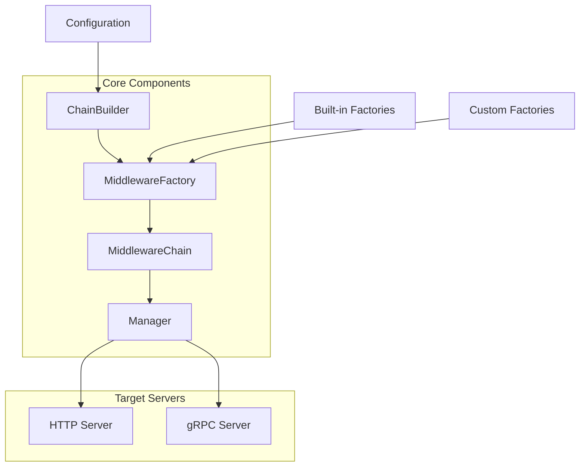

# 可插拔中间件链系统文档

欢迎使用可插拔中间件链（Pluggable Middleware Chaining）系统！这是一个为 go-protoc 项目设计的灵活、可扩展的中间件管理架构。

## 📖 文档导航

| 文档 | 描述 | 适合人群 |
|------|------|----------|
| [🚀 快速入门](./quick-start.md) | 5分钟快速上手，包含基本概念和示例 | 新用户、快速体验 |
| [📋 架构设计](./pluggable-middleware-chain.md) | 完整的系统架构和设计文档 | 开发者、架构师 |
| [📚 API 参考](./api-reference.md) | 详细的 API 接口文档 | 开发者、集成人员 |
| [🔍 可观测性](./observability.md) | 监控、日志、追踪相关文档 | 运维人员、SRE |

## 🎯 系统概述

可插拔中间件链系统解决了以下核心问题：

### ✅ 解决的问题

1. **gRPC 拦截器冲突**: 彻底解决 `panic: The unary server interceptor was already set` 问题
2. **中间件管理复杂**: 提供统一的 HTTP 和 gRPC 中间件管理
3. **配置分散**: 集中化的配置管理和动态加载
4. **扩展困难**: 工厂模式支持轻松添加自定义中间件

### 🏗️ 核心特性

- **🔧 工厂模式**: 支持动态创建和配置中间件
- **⛓️ 链式管理**: 自动按优先级排序和执行
- **🎛️ 配置驱动**: 基于配置文件的中间件启用/禁用
- **🔒 线程安全**: 并发安全的中间件管理
- **🚀 高性能**: 优化的执行链和缓存机制

## 🚀 快速开始

### 1 分钟体验

```go
// 1. 创建管理器
manager := middleware.NewManager()

// 2. 注册工厂
manager.GetBuilder().RegisterFactory(&middleware.LoggingMiddlewareFactory{})

// 3. 加载配置
config := map[string]interface{}{
    "logging": map[string]interface{}{
        "enabled": true,
        "priority": 100,
    },
}
manager.LoadFromConfig(config)

// 4. 应用到服务器
manager.ApplyToHTTPServer(httpServer)
manager.ApplyToGRPCServer(grpcServer)
```

### 完整示例

查看 [快速入门指南](./quick-start.md) 了解详细的使用示例。

## 📋 支持的中间件

| 中间件 | 类型 | 优先级 | 功能 |
|-------|------|--------|------|
| Recovery | HTTP + gRPC | 10 | 错误恢复和 panic 处理 |
| Authentication | HTTP + gRPC | 20 | 身份认证和授权 |
| RateLimit | HTTP + gRPC | 30 | 请求限流和熔断 |
| CORS | HTTP | 50 | 跨域资源共享 |
| Logging | HTTP + gRPC | 100 | 请求日志记录 |

## 🎛️ 配置示例

### 基础配置

```yaml
middleware:
  recovery:
    enabled: true
    priority: 10
  logging:
    enabled: true
    priority: 100
    skip_paths: ["/health", "/metrics"]
```

### 生产环境配置

```yaml
middleware:
  recovery:
    enabled: true
    priority: 10
    enable_stack_trace: false

  authentication:
    enabled: true
    priority: 20
    jwt_secret: "${JWT_SECRET}"
    skip_paths: ["/login", "/health"]

  rate_limit:
    enabled: true
    priority: 30
    limit: 1000
    window: "1m"

  cors:
    enabled: true
    priority: 50
    allowed_origins: ["https://myapp.com"]

  logging:
    enabled: true
    priority: 100
    log_level: "info"
    skip_paths: ["/health", "/metrics"]
```

## 🔧 架构组件



### 核心组件说明

- **Manager**: 统一的中间件管理器
- **ChainBuilder**: 中间件链构建器
- **MiddlewareFactory**: 中间件工厂接口
- **MiddlewareChain**: 中间件执行链
- **Configuration**: 配置驱动系统

## 💡 最佳实践

### 优先级设计

```
10-19: 基础设施中间件 (Recovery, Panic处理)
20-29: 安全中间件 (Authentication, Authorization)
30-39: 限流中间件 (RateLimit, Circuit Breaker)
40-49: 协议处理 (CORS, Headers)
50-99: 业务中间件 (Validation, Transform)
100+:  观测中间件 (Logging, Metrics, Tracing)
```

### 环境配置

- **开发环境**: 启用详细日志，禁用限流，允许所有 CORS
- **测试环境**: 启用基本功能，模拟生产配置
- **生产环境**: 启用所有安全功能，优化性能配置

## 🚨 故障排除

### 常见问题

1. **gRPC 拦截器冲突**
   - 使用延迟构建机制
   - 确保在服务器构建前添加拦截器

2. **中间件不生效**
   - 检查 `enabled: true` 配置
   - 确认工厂已注册
   - 验证是否应用到服务器

3. **配置参数错误**
   - 检查参数类型匹配
   - 确认必需参数已提供

### 调试工具

```go
// 检查注册的工厂
factories := manager.GetBuilder().ListFactories()
fmt.Printf("已注册工厂: %v\n", factories)

// 检查中间件状态
middlewares := manager.ListMiddlewares("http")
for _, mw := range middlewares {
    fmt.Printf("中间件: %s, 启用: %v, 优先级: %d\n",
        mw.Name(), mw.Enabled(), mw.Priority())
}
```

## 🔍 性能指标

| 指标 | 描述 | 监控方式 |
|------|------|----------|
| 执行时间 | 中间件链总执行时间 | Prometheus metrics |
| 内存使用 | 中间件实例内存占用 | pprof 分析 |
| 并发性能 | 高并发下的执行表现 | 压力测试 |
| 错误率 | 中间件执行失败率 | 错误日志统计 |

## 🔧 扩展开发

### 创建自定义中间件

```go
// 1. 实现工厂接口
type CustomFactory struct{}

func (f *CustomFactory) Name() string {
    return "custom"
}

func (f *CustomFactory) CreateHTTP(config map[string]interface{}) (*HTTPMiddlewareFunc, error) {
    // 实现 HTTP 中间件创建逻辑
}

// 2. 注册工厂
manager.GetBuilder().RegisterFactory(&CustomFactory{})

// 3. 配置使用
config := map[string]interface{}{
    "custom": map[string]interface{}{
        "enabled": true,
        "priority": 60,
        // 自定义配置参数
    },
}
```

### 插件化扩展

```go
// 支持插件式加载
type MiddlewarePlugin interface {
    Name() string
    Version() string
    Factories() []MiddlewareFactory
}

func (m *Manager) LoadPlugin(plugin MiddlewarePlugin) error {
    for _, factory := range plugin.Factories() {
        m.builder.RegisterFactory(factory)
    }
    return nil
}
```

## 📊 项目状态

- ✅ **核心功能完成**: 基础架构和 API 设计
- ✅ **内置中间件**: Recovery, Logging, CORS, RateLimit
- ✅ **gRPC 支持**: 拦截器链组合机制
- ✅ **配置系统**: 动态加载和管理
- ✅ **文档完整**: 架构设计、API 参考、快速入门
- 🚧 **性能优化**: 缓存机制和性能调优
- 🚧 **监控集成**: Prometheus metrics 和链路追踪
- 📋 **插件系统**: 第三方中间件插件支持

## 🤝 贡献指南

1. **报告问题**: 在 GitHub Issues 中报告 bug 和功能请求
2. **提交 PR**: 遵循代码规范，包含测试用例
3. **文档改进**: 完善文档和示例代码
4. **性能优化**: 提供性能测试和优化建议

### 开发环境设置

```bash
# 克隆项目
git clone https://github.com/costa92/go-protoc.git

# 进入目录
cd go-protoc

# 安装依赖
go mod tidy

# 运行测试
go test ./pkg/middleware/...

# 启动示例服务器
make run-api
```

## 📜 许可证

本项目采用 [MIT 许可证](../../LICENSE)。

## 🔗 相关资源

- **项目主页**: [go-protoc GitHub](https://github.com/costa92/go-protoc)
- **问题反馈**: [GitHub Issues](https://github.com/costa92/go-protoc/issues)
- **讨论社区**: [GitHub Discussions](https://github.com/costa92/go-protoc/discussions)

## 🙏 致谢

感谢以下开源项目的启发：

- [Gorilla Mux](https://github.com/gorilla/mux) - HTTP 路由和中间件
- [gRPC-Go](https://github.com/grpc/grpc-go) - gRPC 拦截器机制
- [Echo Framework](https://github.com/labstack/echo) - 中间件设计模式

---

> 💡 **提示**: 如果你是第一次使用，建议从 [快速入门指南](./quick-start.md) 开始。如果需要了解详细实现，请查看 [架构设计文档](./pluggable-middleware-chain.md)。
