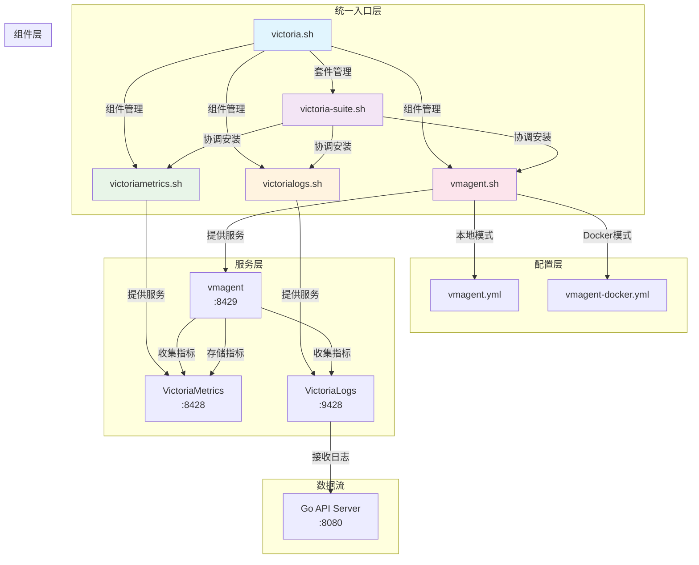
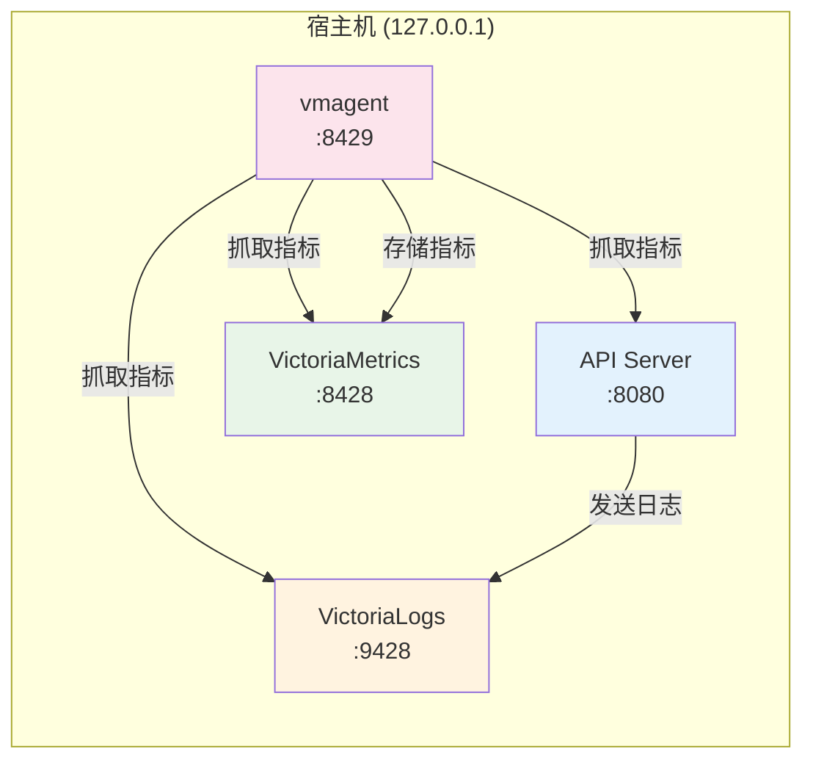
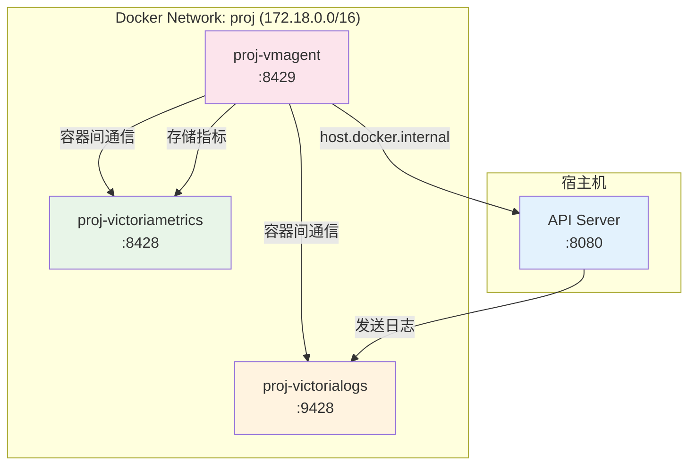
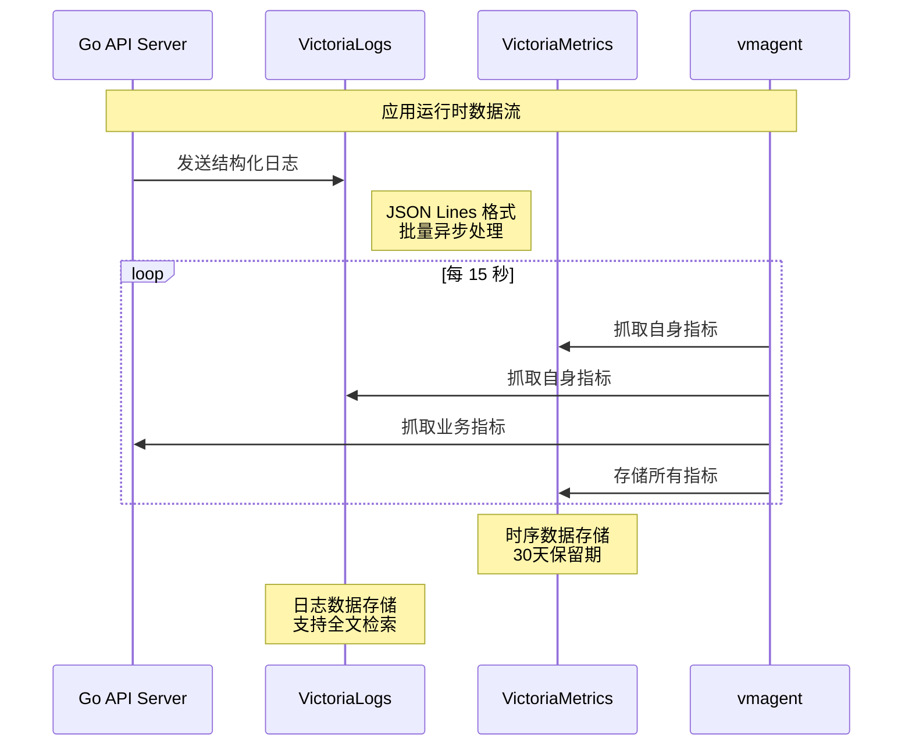

# Victoria Suite 安装脚本目录

本目录包含了完整的 VictoriaMetrics 套件安装和管理脚本，支持时序数据库、日志管理和指标收集的统一解决方案。

## 📁 目录结构

```
scripts/installation/victoria/
├── README.md                    # 本文档 - 目录说明和架构图
├── README-vmagent-config.md     # vmagent 配置文件详细说明
├── victoria.sh                  # 🎯 统一入口脚本 - 套件和组件管理
├── victoria-suite.sh            # 📦 套件管理脚本 - 完整栈安装
├── victoriametrics.sh           # 📊 VictoriaMetrics 组件脚本
├── victorialogs.sh              # 📝 VictoriaLogs 组件脚本  
├── vmagent.sh                   # 🔍 vmagent 收集代理脚本
├── vmagent.yml                  # ⚙️ vmagent 本地安装配置
└── vmagent-docker.yml           # 🐳 vmagent Docker 安装配置
```

## 🧩 文件功能说明

### 📋 核心脚本

#### 🎯 `victoria.sh` - 统一入口脚本
**功能**：提供统一的命令行接口，管理整个 Victoria 套件和单个组件

**核心特性**：
- 统一套件管理（完整栈安装/卸载）
- 单个组件管理（VictoriaMetrics、VictoriaLogs、vmagent）
- 支持本地和 Docker 两种安装模式
- 提供状态检查和信息显示
- 命令行帮助和使用示例

**主要命令**：
```bash
# 套件管理
./victoria.sh install.all          # 安装所有组件
./victoria.sh uninstall.all        # 卸载所有组件
./victoria.sh docker.install       # Docker 模式安装套件
./victoria.sh status               # 检查所有组件状态

# 单组件管理
./victoria.sh victoriametrics.docker.install
./victoria.sh victorialogs.status
./victoria.sh vmagent.info
```

#### 📦 `victoria-suite.sh` - 套件管理脚本
**功能**：协调多个 Victoria 组件的批量安装和管理

**核心特性**：
- 按依赖顺序安装组件（VictoriaMetrics → VictoriaLogs → vmagent）
- 统一的套件状态检查
- 批量操作的错误处理
- 套件级别的信息展示

**依赖关系**：
```
victoria-suite.sh
├── sources victoriametrics.sh
├── sources victorialogs.sh  
└── sources vmagent.sh
```

### 🔧 组件脚本

#### 📊 `victoriametrics.sh` - 时序数据库
**功能**：管理 VictoriaMetrics 时序数据库的安装和配置

**核心特性**：
- 时序数据存储和查询
- 高性能指标数据处理
- Prometheus 兼容的 API
- 支持集群和单机模式
- 数据压缩和长期存储

**服务端点**：
- UI 界面：`http://127.0.0.1:8428`
- 查询 API：`/api/v1/query`
- 写入 API：`/api/v1/write`

#### 📝 `victorialogs.sh` - 日志数据库
**功能**：管理 VictoriaLogs 日志数据库的安装和配置

**核心特性**：
- 大规模日志数据存储
- 高效的日志搜索和过滤
- JSON Lines 格式支持
- 日志聚合和分析
- 与项目日志系统完全集成

**服务端点**：
- UI 界面：`http://127.0.0.1:9428/select/vmui`
- 查询 API：`/select/logsql/query`
- 写入 API：`/insert/jsonline`

#### 🔍 `vmagent.sh` - 指标收集代理
**功能**：管理 vmagent 指标收集代理的安装和配置

**核心特性**：
- 多目标指标抓取
- 支持本地和 Docker 双配置模式
- 自动服务发现
- 指标过滤和转换
- 高可用性和容错

**监控目标**：
- VictoriaMetrics 自身指标
- VictoriaLogs 运行指标
- API 服务器业务指标
- vmagent 自监控指标

### ⚙️ 配置文件

#### 🏠 `vmagent.yml` - 本地安装配置
**用途**：vmagent 在宿主机上运行时的配置

**网络模式**：使用 `127.0.0.1` localhost 地址访问本地服务

**适用场景**：
- 生产环境二进制部署
- systemd 服务管理
- 直接的系统级集成

#### 🐳 `vmagent-docker.yml` - Docker 安装配置  
**用途**：vmagent 在 Docker 容器中运行时的配置

**网络模式**：使用容器名称和 Docker 内部网络

**适用场景**：
- 开发环境快速部署
- 容器化生产环境
- 微服务架构集成

## 🏗️ 系统架构图

### 🎯 总体架构关系



### 🌐 网络架构图

#### 本地安装模式


#### Docker 安装模式


## 🔄 数据流程图



## 🚀 快速开始

### 完整套件安装
```bash
# 1. 安装所有组件 (推荐)
./scripts/installation/victoria.sh install.all

# 2. 检查安装状态
./scripts/installation/victoria.sh status

# 3. 查看服务信息
./scripts/installation/victoria.sh info
```

### 单组件管理
```bash
# 安装单个组件
./scripts/installation/victoria.sh victoriametrics.docker.install
./scripts/installation/victoria.sh victorialogs.docker.install  
./scripts/installation/victoria.sh vmagent.docker.install

# 检查组件状态
./scripts/installation/victoria.sh victoriametrics.status
```

### 配置管理
```bash
# 查看配置文件
ls -la scripts/installation/victoria/vmagent*.yml

# 对比配置差异
diff scripts/installation/victoria/vmagent.yml \
     scripts/installation/victoria/vmagent-docker.yml
```

## 📊 监控访问

| 组件 | Web UI | API 端点 | 用途 |
|------|--------|----------|------|
| **VictoriaMetrics** | http://127.0.0.1:8428 | `/api/v1/query` | 指标查询和可视化 |
| **VictoriaLogs** | http://127.0.0.1:9428/select/vmui | `/select/logsql/query` | 日志查询和分析 |
| **vmagent** | http://127.0.0.1:8429 | `/targets` | 抓取目标状态监控 |

## 🛠️ 常用操作

### Makefile 集成
```bash
# 套件管理
make deploy.install.all.victoria      # 安装所有组件
make deploy.uninstall.all.victoria    # 卸载所有组件
make deploy.status.victoria           # 检查套件状态

# 单组件管理  
make deploy.install.docker.victoriametrics
make deploy.status.victorialogs
make deploy.info.vmagent
```

### 故障排除
```bash
# 检查服务状态
curl http://127.0.0.1:8428/health     # VictoriaMetrics
curl http://127.0.0.1:9428/health     # VictoriaLogs  
curl http://127.0.0.1:8429/health     # vmagent

# 查看抓取目标
curl http://127.0.0.1:8429/targets

# 检查 Docker 网络
docker network inspect proj
```

## 📚 相关文档

- [vmagent 配置详细说明](./README-vmagent-config.md)
- [项目主文档](../../../CLAUDE.md#victoriaLogs-日志集成)
- [Victoria 套件官方文档](https://docs.victoriametrics.com/)

## 🎯 最佳实践

1. **开发环境**：使用 `install.all` 快速部署完整套件
2. **生产环境**：根据需求选择 Docker 或本地安装模式  
3. **监控验证**：定期检查 `/targets` 端点确保数据收集正常
4. **配置管理**：将配置文件纳入版本控制
5. **故障排除**：优先检查网络连通性和服务健康状态

---

💡 **提示**：这个目录实现了完整的 Victoria 监控栈，为项目提供了时序数据、日志管理和指标收集的统一解决方案。